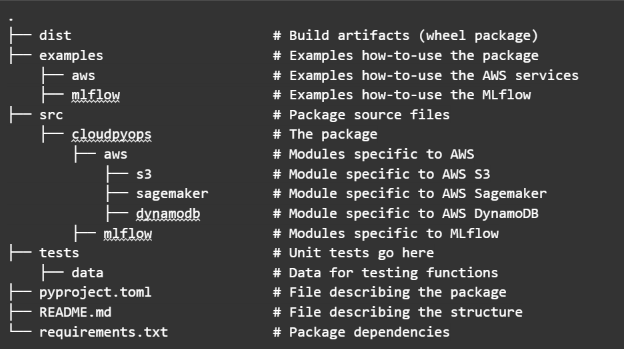

_**Original Source of the blog post: [How I Transformed My Data Science Team's Productivity by Introduction DataOps & MLOps](https://home.mlops.community/public/blogs/how-i-transformed-my-data-science-teams-productivity-by-introducing-dataops-mlops)**_

## Introduction

As a recent engineering graduate within a small but ambitious data science team, I was determined to increase our productivity and dive into the world of cloud technologies and DataOps/MLOps practices. 

Eager to learn and grow, I saw this endeavor as an opportunity not only to transform our team’s performance but also to gain valuable insights into cloud computing and the dynamic fields of DataOps and MLOps. 

In this blog post, I’ll share the transformative journey of how armed with determination and a thirst for knowledge, I implemented Data and MLOps principles that not only skyrocketed our team’s productivity but also empowered us to tackle complex data challenges with newfound efficiency and expertise.

## Challenges Faced

- **Fragmented Data Storage**: Local storage of data by team members led to insecurity and collaboration hurdles
- **Data Versioning**: The absence of data versioning raised concerns about tracking changes and data integrity
- **Limited User Access Control**: Inadequate user access control resulted in data security risks and inefficiencies in handling sensitive information.
- **Manual data Processing**: Manual data processing and transformation caused errors and consumed valuable time.
- **Experiment Tracking and Model Management**: Cumbersome experiment tracking hindered result comparison and identifying optimal models
- **Model Deployment**: Deploying models in production environments required significant effort and resources
- **Accessibility to Resources**: Ensuring easy accessibility to resources for team members of varying experiences was essential

## Centralized and Easily Accessible Data Storage

One of the biggest roadblocks our team faced was the lack of centralized and easily accessible data storage. The data was stored locally by each member of the data science team and usually was badly structured. To address this challenge, I implemented a robust data storage solution using AWS S3. AWS S3 was chosen due to its stability and security, combined with our team’s prior experience with AWS. This centralized repository facilitated efficient access and collaboration on specific datasets for all team members. 

By organizing the data into four phases—raw, raw_aligned, processed, and experiment data—we ensured a clear data transformation pipeline. The raw data represented the most original form, collected from multiple devices with various formats (sensor data, video data, audio data). The raw_aligned data involved synchronizing and aligning the different formats of raw data into one cohesive dataset. 

The processed data resulted from applying specific processing pipelines to the raw aligned data. The experiment data comprised the dataset tailored for conducting experiments, with specific modifications for each experiment. 

All data inside each stage has the same strict structure which allows everything to be easily accessible. Most importantly it allowed us to keep track of all information that is needed. What project that data was for, what task was it for, which participant, and what date and time?

## Data Versioning and User Groups

To enhance data governance, I enabled data versioning on our AWS S3 storage, ensuring traceability and reversibility for every modification. 

Moreover, I established user groups with defined access permissions to bolster data security and maintain data integrity using the AWS IAM service. 

This streamlined collaboration by providing team members access to the necessary data without unnecessary distractions.

## Streamlined Data Transformation Pipeline

The crux of our enhanced productivity lies in the automated data transformation pipeline. Each phase—raw, raw_aligned, processed, and experiment data—had a dedicated pipeline that automatically processed and stored the data accordingly. 

Automation significantly reduced manual errors and accelerated the transition from raw data to experiment-ready insights. Prior to automation, processing data involved time-consuming downloads, processing, and uploads for each phase. 

After automation, the processing pipeline was triggered automatically for each stage, making the entire process nearly instantaneous. For this Data Transformation Pipeline, we utilized AWS Lambda Functions and AWS Sagemaker Processing.

## Centralized MLflow Server for Efficient Experiment Tracking

To ensure seamless experiment tracking and model management, I established a centralized MLflow server hosted on an AWS EC2 instance. 

Hosting MLflow on AWS EC2 provided the necessary resources and scalability to support our data science team’s demands effectively. To enhance security and protect access to the MLflow server, I implemented an additional layer of protection by setting up an Nginx reverse proxy server. 

This reverse proxy server acted as a gateway, directing incoming traffic to the MLflow server while adding an extra level of security. 

Furthermore, I implemented basic authentication on the Nginx server, requiring team members to provide valid credentials before accessing the MLflow dashboard. This multi-layered security approach ensured that only authorized users within our data science team could access and utilize the MLflow server, safeguarding our valuable experiment data and models effectively. 

With this robust setup, we could confidently focus on our experiments and model iterations, knowing that our data and infrastructure were well-protected.

## Deploying Winning Models with ML Batch Serverless Inference

In our quest to operationalize our models, I developed a custom microservice—ML batch serverless inference—to deploy the best-performing models seamlessly. This serverless approach allowed us to manage resources efficiently and scale effortlessly, ensuring our models could be readily deployed in production environments with minimal overhead. 

This system integrated AWS API Gateway, Sagemaker Processing, Lambda functions, Elastic Container Registry (ECR), and more. By combining these multiple AWS services, we created an optimal, resource-friendly solution that empowered our data science team to deliver valuable insights with ease and precision.

## Python module with necessary scripts and configurations

To ensure that every member of our data science team could easily access and utilize the resources and infrastructure we had implemented, I developed a Python module called CloudPyOps that encapsulated all the necessary scripts and configurations. 

This module served as a one-stop-shop for accessing our centralized data storage, data transformation pipelines, MLflow server, and the ML batch serverless inference microservice. With just a few lines of code, any data scientist in our team could now interact with these components effortlessly, eliminating the need for manual setups or complex configurations. 

This streamlined accessibility not only saved time but also fostered a collaborative environment, where every team member could focus on their core tasks and make the most out of the cutting-edge tools at our disposal.

_**Python Module Structure**_

## What’s next?

As we continue our pursuit of excellence, the next steps on our journey as a team involve implementing Language Model Models (LLMs) that can provide valuable context to the outputs of our other ML algorithms. By integrating LLMs, we aim to enhance the interpretability and depth of insights gained from our models, further empowering data-driven decision-making.

In the upcoming blog posts, I will dive more deeply into the implementation of each resource separately and the implementation of the LLMs.

Implementing Data and MLOps principles transformed our data science team’s productivity from struggling with fragmented data and manual processes to achieving seamless collaboration, faster experimentation, and efficient model deployment. If this blog post has sparked ideas and inspiration for your own team, I am thrilled to have played a part in helping you enhance collaboration, streamline processes, and achieve remarkable results. Embracing the power of data-driven practices and MLOps can propel your team toward greater success and innovation. 

Be tuned for new blog posts!