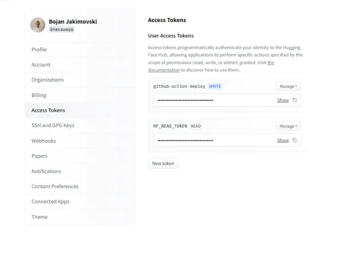
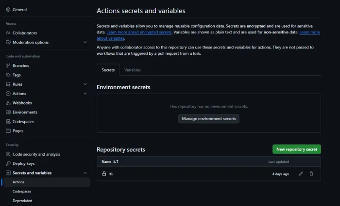

_**Original Source of the blog post: [Unleashing the Power of Large Language Models in Healthcare and Wellness: Practical Context Providing in Healthcare and Wellness with Mistral 7B](https://mlops.community/%f0%9f%a4%b8%e2%9a%95%ef%b8%8funleashing-the-power-of-large-language-models-in-healthcare-and-wellness-practical-context-providing-in-healthcare-and-wellness-with-mistral-7b/)**_

We find ourselves on the brink of a transformative era in artificial intelligence, poised to reshape our daily experiences. At the forefront of this revolution stand Large Language Models (LLMs), heralding a new wave of possibilities. While LLMs have already begun making strides across various sectors, their full potential remains untapped, particularly in specialised fields such as healthcare and wellness.

The landscape of AI in healthcare and wellness is not a recent innovation; its relentless growth and evolution continually redefine the limits of what we once deemed achievable. Machine learning algorithms have played pivotal roles, aiding physicians in diagnosing diseases, contributing to drug discovery, and refining the precision of surgical procedures. The integration of AI in wellness has given rise to an array of smart devices and applications designed to enhance our physical and mental well-being.

Among the cutting-edge developments in healthcare and wellness are eating recognition and human activity recognition. These sophisticated algorithms seek to comprehend user behaviour, such as dietary habits or physical activity patterns, providing personalised feedback or advice. However, the raw outputs from these algorithms occasionally lack the nuanced context required for practical, day-to-day guidance.

Introducing Large Language Models (LLMs), the tools that can provide this much-needed context and transform the raw outputs into actionable insights.

In this blog post, we’ll only scratch the surface of the vast potential offered by Large Language Models (LLMs). The initial exploration will focus on leveraging LLMs to extract meaningful context from the outputs generated by eating and human activity recognition algorithms—commonplace in the healthcare and wellness domain. This application holds the promise of revolutionising healthcare practices and wellness strategies, addressing both existing challenges and uncovering new opportunities.

In the subsequent section, we’ll delve into a practical deployment scenario, showcasing the integration of a Large Language Model—specifically, the pretrained Mistral-7B—into a Web App as Chat App. This deployment involves a sophisticated orchestration across various platforms and technologies, including but not limited to Hugging Face Spaces, Github, PyTorch, Gradio, and more. This strategic deployment not only exemplifies the versatility of LLMs but also underscores the significance of effective MLOps practices, ensuring seamless integration and sustained performance in real-world applications.

## 🍽️ 🏃 Eating and Human Activity Recognition Algorithms

Algorithms designed for eating recognition and human activity recognition predominantly rely on raw sensor data, incorporating information from Inertial Measurement Unit (IMU) sensors, images, or a combination of both. Regardless of the data type, these algorithms typically yield outputs categorised as binary or multiclass, signaling actions such as eating or not in the context of eating recognition, and activities like sitting, standing, walking, running, cycling, or climbing for human activity recognition.

However, these categorical outputs have inherent limitations, offering a surface-level understanding of user actions or states. Through subsequent postprocessing of these outputs, a more nuanced and valuable layer of information can be extracted. Postprocessing, for example, enables the derivation of insights like the duration of a specific activity, energy expenditure derived from human activity recognition algorithms, or detailed aspects of an eating session, such as the number of chews, calorie consumption estimations, or specifics about the consumed food from eating recognition algorithms.

Despite the enhanced information gained through postprocessing, a key drawback is the lack of personalization in most extracted details. Addressing this limitation, Large Language Models (LLMs) present a solution by facilitating the engineering of prompts for postprocessed outputs. This capability opens the door to obtaining personalised insights from the data, significantly enriching the interpretability and relevance of the information derived from eating and human activity recognition algorithms.

_**LLMs in combination with other Algorithms**_

## 📄 Context Providing using Postprocessed Outputs from Algorithms

Some of the ideas that already pop out in the healthcare and wellness AI communities on how the LLMs can be used for context providing using post-processed outputs are:

- Personalised Dietary Guidance
- Meal Planning
- Personalised Exercise Recommendations
- Lifestyle Optimization

Let us tackle each of the ideas!

### 🥗 Personalized Dietary Guidance:

The synergy between eating recognition algorithms and LLMs is particularly evident when it comes to personalised dietary advice. For instance, suppose the algorithm detects a pattern of excessive consumption of sugary snacks within an individual’s dietary habits. While this data is informative, it may leave the user wondering, “What can I do about it?” The LLMs can step in to provide tailored recommendations and help the user. Drawing upon their extensive knowledge, LLMs can suggest healthier alternatives and devise strategies specifically suited to an individual’s preferences and dietary restrictions. This means that if someone is trying to reduce their sugar intake, LLMs can furnish them with a comprehensive plan, addressing not just what to avoid but also what to embrace, making the journey towards healthier eating a more informed and manageable one. This is an example of how the LLMs can be used for Personalized Dietary Guidance. Let’s simulate that our algorithms have detected changes in the chewing rate, increased calories consumed, and excessive consumption of sugary snacks. This is the output we get using the Mistral-7B model:

_**Example of Personalized Dietary Guidance**_

### 🍜️ Meal Planning:

The utility of LLMs extends beyond the scope of corrective advice and delves into the realm of proactive meal planning. Users with dietary goals and restrictions can find a reliable ally in LLMs when it comes to crafting a meal plan that aligns perfectly with their nutritional needs. The collaborative effort between eating recognition algorithms, human activity recognition algorithms, and LLMs ensures that meal suggestions are not just generic but highly personalised. By utilising the outputs generated from eating recognition algorithms, and the outputs generated from human activity recognition, the LLMs can recommend recipes and meal ideas that resonate with the user’s unique dietary objectives. Whether it is weight loss, muscle gain, or adhering to a specific dietary regimen, LLMs have the potential to become the user’s trusted partner in the pursuit of their culinary aspirations in combination with their body goals.This is an example of how the LLMs can be used for Meal Planning. Let’s simulate that our algorithms have detected an increased number of steps, increased cycling activity, calorie consumption, and excessive consumption of proteins. Let’s ask the LLM (Mistral-7B model) to analyse our algorithm outputs and give us some advice for increasing muscle mass:

_**Example of Meal Planning**_

### 🏋🏻 Personalized Exercise Recommendations:

Thanks to the prowess of human activity recognition algorithms, we are now capable of obtaining an intricate snapshot of a user’s physical activities, from the number of steps taken to the heart rate measurements during a rigorous workout session. Yet, these insights, no matter how comprehensive, are merely the beginning. LLMs, with their innate ability to decipher the nuances of human behaviour, take this data to a whole new level. They sift through the numbers and statistics, considering not just the quantitative aspects but also the qualitative dimensions of the user’s physical activity. The result? LLMs can generate highly personalised exercise recommendations, tailored to the user’s unique fitness goals and preferences. For example, if the algorithm detects a significant decrease in physical activity, the LLM (Large Language Model) can go the extra mile by suggesting exercise routines that precisely match the user’s fitness level, thereby making exercise regimens more effective and user-centric than ever before. This is an example of how the LLMs can be used for Personalised Exercise Recommendations. Let’s simulate that we already set up our goals for our body and we have something detected from the algorithms for human activity recognition. This is a plan for exercises we get from the Mistral-7B model as a result:

_**Example of Personalised Exercise Recommendations**_

_**Wellness with AI in everyday life**_

### 🧘🏻‍♀️ Lifestyle Optimization:

LLMs extend their intelligence beyond just exercise recommendations. These models are adept at offering comprehensive lifestyle optimization advice, capitalising on their analytical prowess and deep understanding of human activity recognition data. By utilising the outputs generated by these recognition systems, LLMs can recommend substantial lifestyle changes. This may include proposing adjustments to sleep patterns for a more restful night’s sleep, encouraging the incorporation of short, rejuvenating breaks during sedentary work hours, or even suggesting stress reduction techniques based on activity and heart rate patterns. LLMs become your virtual lifestyle consultants, tirelessly working in the background to enhance the quality of your life, one data point at a time. This is an example of how the LLMs can be used for Lifestyle Optimization. Let’s simulate that the algorithms gave some post-processed outputs from which the LLM(Mistral-7B model) can extract multiple information about our current lifestyle and health conditions. Let’s see what improvements can we have:

_**Example of Lifestyle Optimization**_

## ❗ Potential Problems with using LLMs as Context Providers

While the integration of LLMs with healthcare and wellness algorithms such as eating recognition or human activity recognition algorithms offers immense potential, it also raises some concerns such as:

- Data Privacy and Sensitivity – Even if the data is “anonymized”, patterns or details might inadvertently reveal sensitive information about individuals.
- Accuracy and Reliability – If the eating recognition or human activity recognition algorithm makes an error, the LLM might provide context based on incorrect information leading to misinformation or misunderstanding.
- Ethical Considerations – The combination of algorithms might lead to situations where the system’s output can affect human behaviour. For example, if an eating recognition system suggests someone is overeating and the LLM provides context that discourages them, it might negatively affect individuals with eating disorders.
- Feedback Loops – If users continuously interact with the system and adapt their behaviours based on the feedback, it can create feedback loops where the system and the user influence each other in potentially harmful ways.
- Loss of Human Touch – Using algorithms to understand and contextualise human activities can sometimes strip away the nuances and complexities of human experience.
- Hallucinations – Sometimes the LLM can generate details and information that are not supported or at least proven by scientific evidence or reliable sources, which can bring serious consequences, especially in the healthcare context.
- Lack of User Condition Information: Sometimes the LLM will not take into consideration the health condition of the user(patient), for example, if the user has diabetes, some allergies, etc.

To address these challenges, it is important to:

- Continuously validate and update both the recognition algorithms and the LLMs.
- Ensure transparency in how these systems work and make decisions.
- Engage ethicists, psychologists, and other relevant experts in the design and deployment process.
- Educate users about the capabilities and limitations of such systems.
- Implement strong data privacy measures to protect user data.
- Validation of information generated by the LLM to ensure it aligns with the established facts and source.
- Including the user’s current health condition in the prompts.

## 🖥️☁️ Practical and Simple Deployment of Mistral 7B LLM for Healthcare and Wellness

In the second part of this blog post, we will delve into how we can deploy an LLM for Healthcare and Wellness, to be precise the pre-trained Mistral 7B model. Mistral 7B is chosen because it’s a new SOTA LLM which shows remarkable performance, compared to other LLMs like Llama 2.0. It excels in a broad spectrum of tasks in many domains including Healthcare and Wellness. It allows fast inference which is crucial for Healthcare and Wellness, it is released under an Apache 2.0 license allowing unrestricted access to it, for everyone. Now by following the step-by-step guide we are going to create a Web App with Mistral 7B hosted on Hugging Face spaces:

### Step 1: Fork the GitHub Repo with the code
Fork the GitHub [repository - **This repository is not publicly available anymore**](https://github.com/Shekswess/Mistral-7B-Healthcare) that contains the code for deploying the Mistral 7-B model and the Web App. Once forked, you’ll have your own copy of the repository to work with. 

_**Repository example**_

### Step 2: Creating Hugging Face Space
Go to the Hugging Face and create a new space for deploying the entire application. This space will be used to host your model and web app.

_**Hugging Face Space**_

### Step 3: Create User Access Tokens on Hugging Face
Generate two user access tokens on Hugging Face – one with write permission named github-action-deploy and another with read permission named HF_READ_TOKEN. These tokens will be used to interact with the Hugging Face API.

_**Creation of tokens**_

### Step 4: Add Tokens to GitHub Repo as Secrets
Add the generated GitHub-action-deploy as a secret to your GitHub repository. Name them appropriately, e.g., HF_WRITE_TOKEN(or as I named them in my workflow HG). These secrets will be used in your GitHub Actions workflow.

_**GitHub Secrets**_

### Step 5: Update GitHub Actions Workflow
Modify the GitHub Actions workflow file in your repository to use the secrets and Hugging Face space name. Replace placeholders in the workflow file with the actual values for tokens(secrets) and space names. Specifically, update the secrets section to use the HF_WRITE_TOKEN(or as I named them in my workflow HG) secret, and set the Hugging Face space name.

_**GitHub Actions Workflow**_

### Step 6: Commit and Trigger Deployment
Commit the changes made to the workflow file and push it to the main branch of your GitHub repository. This commit will trigger the GitHub Actions workflow, which will use the provided secrets and Hugging Face space to deploy the Mistral 7-B model and the associated Web App.

Once the workflow is triggered, it will handle the deployment process, and you can monitor the progress in the Actions tab of your GitHub repository.

After successful deployment on your Hugging Face space, the Web App will start to build and prepare to be started.

Make sure to regularly check the logs and make any necessary adjustments based on the feedback from the GitHub Actions workflow and the Logs from Hugging Face space. This process ensures a seamless deployment of the Mistral 7-B model with the Web App using Hugging Face and GitHub Actions.

If everything is successful you will be provided with this Web (Chat) App with a simple UI to test how LLMs(Mistral 7-B) can be used in Healthcare and Wellness use cases.

## 🙌 Conclusion
In conclusion, the integration of outputs from diverse algorithms, including eating recognition and human activity recognition algorithms, combined with Large Language Models (LLMs), marks a significant milestone in transforming the Healthcare and Wellness fields. These technological advancements empower healthcare professionals to offer precise advice, interpret algorithmic results, and tailor recommendations to individual needs. It is crucial, however, to strike a balance between technological progress and ethical considerations, safeguarding the privacy and security of personal health data and general personal data. With appropriate precautions, these fully autonomous systems, when checked for response accuracy, can prove invaluable to doctors in monitoring and maintaining their patients’ health. LLMs, in particular, stand out as powerful tools that can contribute to informed decision-making, fostering a healthier and happier life for individuals.
