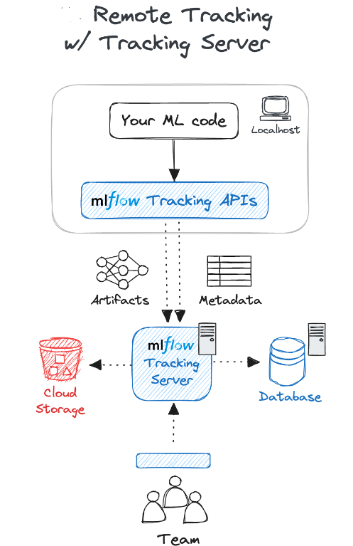
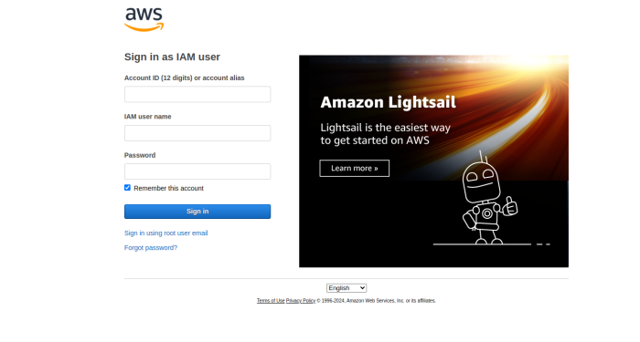
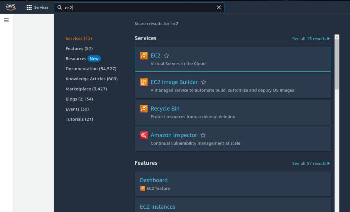
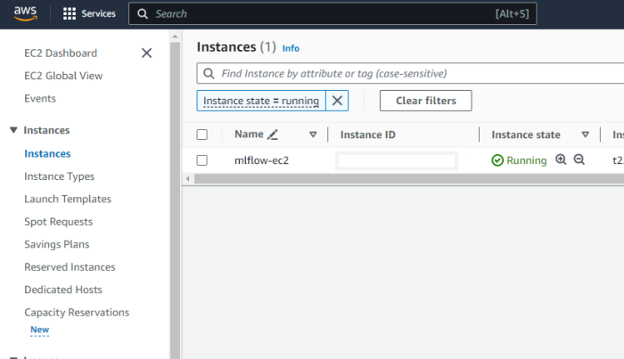
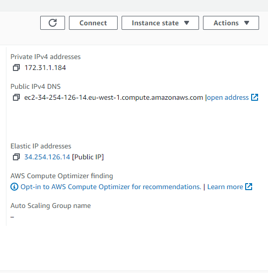
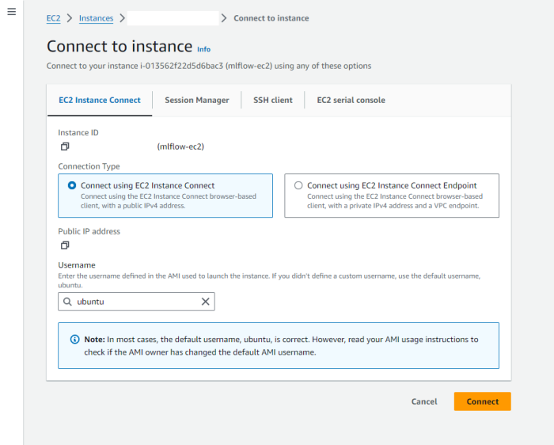
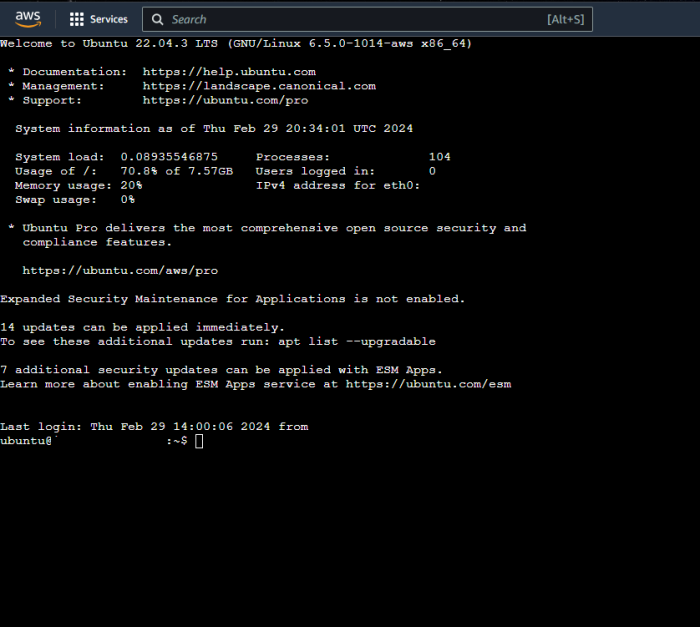
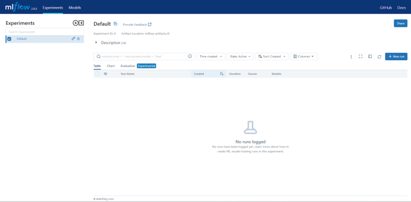

_**Original Source of the blog post: [MLflow on AWS with Pulumi: A Step-by-Step Guide](https://home.mlops.community/public/blogs/mlflow-on-aws-with-pulumi-a-step-by-step-guide)**_

Many data science and machine learning teams grapple with the challenge of effectively tracking numerous experiments and their corresponding results. Often, they resort to using cumbersome methods such as Excel spreadsheets and manual record-keeping, leading to overwhelming data management and hindering collaboration within the team.

This manual approach not only consumes valuable time and effort but also introduces the risk of errors and inconsistencies. Moreover, teams may encounter difficulties in reproducing experiments, retrieving specific model versions, and managing model versioning effectively.

These challenges can impede the scalability and reproducibility of the machine learning workflows, highlighting the crucial need for a more streamlined and automated solution like MLflow, which offers comprehensive experiment tracking, model versioning, and collaboration tools to alleviate these pain points and foster greater efficiency and teamwork within data science projects.

In this tutorial, we’ll demonstrate how to deploy an MLflow tracking server on AWS using Pulumi. Pulumi allows us to configure AWS cloud resources easily by creating infrastructure with Python code. By automating the deployment process, we eliminate manual configuration errors and ensure a scalable, reproducible environment for our machine learning projects.


_**MLflow Tracking Server**_

## Step 0: Prerequisites and Installation

Before proceeding with this tutorial, ensure that you have the following prerequisites installed:

- Python: This tutorial uses Python for scripting and configuration. Make sure Python is installed on your system. You can download Python from the official Python website: https://www.python.org/downloads/.

- Pulumi: Pulumi is required to define and manage cloud infrastructure using code. Install Pulumi by following the instructions provided on the official Pulumi website: https://www.pulumi.com/docs/get-started/install/.

- AWS CLI: The AWS Command Line Interface (CLI) is necessary to interact with AWS services. Install the AWS CLI by following the instructions provided on the official AWS documentation: https://docs.aws.amazon.com/cli/latest/userguide/cli-chap-install.html.

- Admin IAM credentials: Ensure you have an AWS account and IAM (Identity and Access Management) credentials set up. You will need an access key ID and a secret access key to authenticate the AWS CLI with your AWS account.

Once you have installed these prerequisites, you’ll be ready to deploy the MLflow tracking server on AWS using Pulumi.

## Step 1: Creating Pulumi Project

The first step needed is to create a directory for the Pulumi project and initialize the default Pulumi project:

```bash
mkdir mlflow-pulumi
cd mlflow-pulumi
pulumi new aws-python -y
```

## Step 2: Install the necessary Python packages

Install the required Python packages for working with Pulumi, which will allow us to interact with AWS services:

```bash
pip install pulumi pulumi_aws
```

### Step 3.1: Create the services directory and Python files

Navigate to your Pulumi project directory if you’re not already there and create a directory named services, then navigate into the directory and create 3 Python files named `ec2.py`, `s3.py`, `rds.py`:`

```bash
mkdir services
cd services
touch ec2.py s3.py rds.py
```

#### Step 3.2.1: Define the S3 artifact storage code

We are defining the code needed for creating an S3 storage-bucket responsible for storing the artifacts from the MLflow tracking server. To define the bucket, we need to provide two parameters: the name of the bucket and the access control list (preferably private). This code is located in the `s3.py` file.

```python
import logging
from pulumi_aws import s3

logger = logging.getLogger("s3")
logger.setLevel(logging.INFO)

def create_s3_bucket(name: str, acl: str = "private") -> s3.Bucket:
    """
    Create an S3 bucket
    :param name: The name of the bucket
    :param acl: The access control list
    :return: The S3 bucket
    """
    try:
        logger.info(f"Creating S3 bucket: {name}")
        bucket = s3.Bucket(name, acl=acl)
        return bucket
    except Exception as error:
        logger.error(f"Error creating S3 bucket: {error}")
        raise error
```
#### Step 3.2.2: Define the RDS Metadata Database code

The next step is to define the code required for setting up the RDS database, which stores the metadata of the experiments. Firstly, we need to define the creation of a dedicated RDS subnet to facilitate communication between the server (EC2) and the RDS server. This special subnet ensures secure and efficient data transfer. Following the definition of the creation of the subnet, we define the RDS server. We opt for running a Postgres database version 13.8 on the smallest, most cost-effective instance, db.t3.micro. For more details about the parameters needed for the code, refer to the docstrings of the functions.

```python
import logging
from pulumi_aws import rds

logger = logging.getLogger("rds")
logger.setLevel(logging.INFO)


def create_rds_subnet_group(name: str, subnet_ids: list[str]) -> rds.SubnetGroup:
    """
    Create an RDS subnet group
    :param name: The name of the subnet group
    :param subnet_ids: The subnet IDs
    :return: The subnet group
    """
try:
    logger.info(f"Creating RDS subnet group: {name}")
    subnet_group = rds.SubnetGroup(name, subnet_ids=subnet_ids)
    return subnet_group
except Exception as error:
    logger.error(f"Error creating RDS subnet group: {error}")
    raise error


def create_rds_instance(
    name: str,
    db_name: str,
    subnet_group_name: str,
    security_group_name: str,
    username: str,
    password: str,
    ) -> rds.Instance:
    """
    Create an RDS instance
    :param name: The name of the RDS instance
    :param db_name: The name of the database
    :param subnet_group_name: The name of the subnet group
    :param security_group_name: The name of the security group
    :param username: The username for the RDS instance
    :param password: The password for the RDS instance
    :return: The RDS instance
    """
    try:
        logger.info(f"Creating RDS instance: {name}")
        rds_instance = rds.Instance(
                name,
                allocated_storage=20,
                engine="postgres",
                engine_version="13.8",
                instance_class="db.t3.micro",
                db_name=db_name,
                username=username,
                password=password,
                skip_final_snapshot=False,
                db_subnet_group_name=subnet_group_name,
                vpc_security_group_ids=[security_group_name],
        )
        return rds_instance
    except Exception as error:
        logger.error(f"Error creating RDS instance: {error}")
        raise error
```


#### Step 3.2.3: Define EC2 code

The crucial step in this process is defining the EC2 virtual server, which will host the MLflow remote tracking server. Before proceeding, ensure that you have already defined the code for a Virtual Private Cloud (VPC) to provide network isolation. Within the VPC, it’s essential to establish a subnet network dedicated to handling communication with the EC2 instance, so we need to define the code for subnet networks.

```python
import logging
from pulumi_aws import ec2

logger = logging.getLogger("ec2")
logger.setLevel(logging.INFO)

def create_vpc(name: str, cidr_block: str) -> ec2.Vpc:
    """
    Create a VPC
    :param name: The name of the VPC
    :param cidr_block: The CIDR block of the VPC
    :return: The VPC
    """
    try:
        logger.info(f"Creating VPC: {name}")
        vpc = ec2.Vpc(
            name,
            cidr_block=cidr_block,
            enable_dns_support=True,
            enable_dns_hostnames=True,
        )
        logger.info(f"VPC created: {vpc.id}")
        return vpc
    except Exception as error:
        logger.error(f"Error creating VPC: {error}")
        raise error
```

Additionally, we need to define the configuring of an Internet Gateway to enable internet access for the EC2 instance. This access is vital for ML engineers and data scientists to interact with the server, send experiments, and access artifacts. To control access and ensure security, define a Security Group specifying which traffic types, protocols, ports, and IP addresses are allowed.

```python
def create_subnet(
    name: str, vpc_id: str, cidr_block: str, availability_zone: str
    ) -> ec2.Subnet:
    """
    Create a subnet
    :param name: The name of the subnet
    :param vpc_id: The ID of the VPC
    :param cidr_block: The CIDR block of the subnet
    :param availability_zone: The availability zone of the subnet
    :return: The subnet
    """
    try:
        logger.info(f"Creating subnet: {name}")
        subnet = ec2.Subnet(
            name,
            vpc_id=vpc_id,
            cidr_block=cidr_block,
            availability_zone=availability_zone,
        )
        return subnet
    except Exception as error:
        logger.error(f"Error creating subnet: {error}")
        raise error


def create_internet_gateway(name: str, vpc_id: str) -> ec2.InternetGateway:
    """
    Create an internet gateway
    :param name: The name of the internet gateway
    :param vpc_id: The ID of the VPC
    :return: The internet gateway
    """
    try:
        logger.info(f"Creating internet gateway: {name}")
        ig = ec2.InternetGateway(name, vpc_id=vpc_id)
        return ig
    except Exception as error:
        logger.error(f"Error creating internet gateway: {error}")
    raise error


def create_security_group_ingress(
    from_to_ports: list[int],
    protocol: str,
    cidr_blocks: list[str],
    ) -> ec2.SecurityGroupIngressArgs:
    """
    Create a security group ingress
    :param from_to_ports: The from and to ports
    :param protocol: The protocol
    :param cidr_blocks: The CIDR blocks
    :return: The security group ingress
    """
    try:
        logger.info(
        f"Creating security group ingress: {from_to_ports} {protocol} {cidr_blocks}"
        )
        ingress = ec2.SecurityGroupIngressArgs(
            from_port=from_to_ports[0],
            to_port=from_to_ports[1],
            protocol=protocol,
            cidr_blocks=cidr_blocks,
        )
        return ingress
    except Exception as error:
        logger.error(f"Error creating security group ingress: {error}")
        raise error


def create_security_group_egress(
    from_to_ports: list[int],
    protocol: str,
    cidr_blocks: list[str],
    ) -> ec2.SecurityGroupEgressArgs:
    """
    Create a security group egress
    :param from_to_ports: The from and to ports
    :param protocol: The protocol
    :param cidr_blocks: The CIDR blocks
    :return: The security group egress
    """
    try:
        logger.info(
        f"Creating security group egress: {from_to_ports} {protocol} {cidr_blocks}"
        )
        egress = ec2.SecurityGroupEgressArgs(
            from_port=from_to_ports[0],
            to_port=from_to_ports[1],
            protocol=protocol,
            cidr_blocks=cidr_blocks,
        )
        return egress
    except Exception as error:
        logger.error(f"Error creating security group egress: {error}")
        raise error


def create_security_group(
    name: str,
    vpc_id: str,
    security_ingress: list[ec2.SecurityGroupIngressArgs],
    security_egress: list[ec2.SecurityGroupEgressArgs],
    ) -> ec2.SecurityGroup:
    """
    Create a security group
    :param name: The name of the security group
    :param vpc_id: The ID of the VPC
    :param security_ingress: The security group ingress
    :param security_egress: The security group egress
    :return: The security group
    """
    try:
        logger.info(f"Creating security group: {name}")
        security_group = ec2.SecurityGroup(
            name,
            vpc_id=vpc_id,
            ingress=security_ingress,
            egress=security_egress,
        )
        return security_group
    except Exception as error:
        logger.error(f"Error creating security group: {error}")
        raise error
```

Once these elements are defined, proceed to define the code for creating the EC2 instance. Opt for the t2.micro instance type, which falls under the free tier and is the most economical option. Also, define the creation of a routing table and add a route for internet access to enable seamless communication with the outside world.

```python
def create_ec2_instance(
    name: str,
    instance_type: str,
    ami: str,
    subnet_id: str,
    vpc_security_group_ids: list,
    key_name: str,
    ) -> ec2.Instance:
    """
    Create an EC2 instance
    :param name: The name of the EC2 instance
    :param instance_type: The instance type
    :param ami: The AMI
    :param subnet_id: The ID of the subnet
    :param vpc_security_group_ids: The IDs of the security groups
    :param key_name: The name of the key pair
    :return: The EC2 instance
    """
    try:
        logger.info(f"Creating EC2 instance: {name}")
        instance = ec2.Instance(
            name,
            instance_type=instance_type,
            ami=ami,
            subnet_id=subnet_id,
            vpc_security_group_ids=vpc_security_group_ids,
            key_name=key_name,
        )
        return instance
    except Exception as error:
        logger.error(f"Error creating EC2 instance: {error}")
        raise error

def create_ipv4_public_ip(name: str, server_id: str) -> ec2.Eip:
    """
    Create an IPv4 public IP
    :param name: The name of the IPv4 public IP
    :param server_id: The ID of the server
    :return: The IPv4 public IP
    """
    try:
        public_ip = ec2.Eip(name, instance=server_id)
        return public_ip
    except Exception as error:
        logger.error(f"Error creating IPv4 public IP: {error}")
        raise error


def get_route_table(name: str, route_table_id: str) -> ec2.RouteTable:
    """
    Get a route table
    :param name: The name of the route table
    :param route_table_id: The ID of the route table
    :return: The route table
    """
    try:
        route_table = ec2.RouteTable.get(name, route_table_id)
        return route_table
    except Exception as error:
        logger.error(f"Error getting route table: {error}")
        raise error


def create_route(
    name: str,
    route_table_id: str,
    destination_cidr_block: str,
    gateway_id: str,
    ) -> ec2.Route:
    """
    Create a route
    :param name: The name of the route
    :param route_table_id: The ID of the route table
    :param destination_cidr_block: The destination CIDR block
    :param gateway_id: The ID of the gateway
    :return: The route
    """
    try:
        route = ec2.Route(
            name,
            route_table_id=route_table_id,
            destination_cidr_block=destination_cidr_block,
            gateway_id=gateway_id,
        )
        return route
    except Exception as error:
        logger.error(f"Error creating route: {error}")
        raise error
```

### Step 3.4: Define the services in the **main**.py file

Now when all the elements are defined with code, we need to create them by using the **main**.py script. The next step is calling all the building code blocks within the **main**.py file.

We need to import all the functions which define the elements for each of the AWS services we are going to use. The first elements that are going to be created are the Virtual Private Cloud (VPC) which will use the 10.0.0.1/16 CIDR block and two subnet networks that will use different subregions(availability zones) and CIDR blocks.

```python
import logging
import pulumi
from services.ec2 import (
create_ec2_instance,
create_internet_gateway,
create_ipv4_public_ip,
create_route,
create_security_group,
create_security_group_egress,
create_security_group_ingress,
create_subnet,
create_vpc,
get_route_table,
)
from services.rds import create_rds_instance, create_rds_subnet_group
from services.s3 import create_s3_bucket

if __name__ == "__main__":
    logger = logging.getLogger("pulumi")
    logger.setLevel(logging.INFO)
    logging.info("Creating infrastructure for MLflow Tracking Server")
    name_vpc = "mlflow-vpc"
    cidr_block_vpc = "10.0.0.0/16"
    vpc = create_vpc(name_vpc, cidr_block_vpc)
    logging.info(f"VPC created: {vpc.id}")
    name_subnet_1 = "mlflow-subnet-1"
    cidr_block_subnet_1 = "10.0.1.0/24"
    availability_zone_1 = "eu-west-2a"
    subnet_1 = create_subnet(
    name_subnet_1, vpc.id, cidr_block_subnet_1, availability_zone_1
    )
    logging.info(f"Subnet created: {subnet_1.id}")
    name_subnet_2 = "mlflow-subnet-2"
    cidr_block_subnet_2 = "10.0.2.0/24"
    availability_zone_2 = "eu-west-2b"
    subnet_2 = create_subnet(
    name_subnet_2, vpc.id, cidr_block_subnet_2, availability_zone_2
    )
```

After that we are creating the internet gateway and creating the security groups for secure access to the EC2 instance. We are going to allow all the inbound traffic on port 22, for SSH traffic, all traffic on port 80 for HTTP, port 5000 on which the MLlflow tracking server will work and port 443 which is allocated for HTTPS traffic. Also we are going to allow outbound traffic on all ports and IP addresses.

```python
name_ig = "mlflow-ig"
ig = create_internet_gateway(name_ig, vpc.id)
logging.info(f"Internet Gateway created: {ig.id}")
ingress_1_from_to_ports = [22, 22]
ingress_1_protocol = "tcp"
ingress_1_cidr_blocks = ["0.0.0.0/0"]
ingress_1 = create_security_group_ingress(
    ingress_1_from_to_ports,
    ingress_1_protocol,
    ingress_1_cidr_blocks,
)
logging.info(f"Security Group Ingress created: {ingress_1}")
ingress_2_from_to_ports = [80, 80]
ingress_2_protocol = "tcp"
ingress_2_cidr_blocks = ["0.0.0.0/0"]
ingress_2 = create_security_group_ingress(
    ingress_2_from_to_ports,
    ingress_2_protocol,
    ingress_2_cidr_blocks,
)
logging.info(f"Security Group Ingress created: {ingress_2}")
ingress_3_from_to_ports = [5000, 5000]
ingress_3_protocol = "tcp"
ingress_3_cidr_blocks = ["0.0.0.0/0"]
ingress_3 = create_security_group_ingress(
    ingress_3_from_to_ports,
    ingress_3_protocol,
    ingress_3_cidr_blocks,
)
logging.info(f"Security Group Ingress created: {ingress_3}")
ingress_4_from_to_ports = [443, 443]
ingress_4_protocol = "tcp"
ingress_4_cidr_blocks = ["0.0.0.0/0"]
ingress_4 = create_security_group_ingress(
    ingress_4_from_to_ports,
    ingress_4_protocol,
    ingress_4_cidr_blocks,
)
egress_1_from_to_ports = [0, 0]
egress_1_protocol = "-1"
egress_1_cidr_blocks = ["0.0.0.0/0"]
egress_1 = create_security_group_egress(
    egress_1_from_to_ports,
    egress_1_protocol,
    egress_1_cidr_blocks,
)
logging.info(f"Security Group Egress created: {egress_1}")
security_group_name = "mlflow-sg"
security_group = create_security_group(
    security_group_name,
    vpc.id,
    [ingress_1, ingress_2, ingress_3, ingress_4],
    [egress_1],
)
logging.info(f"Security Group created: {security_group.id}")
```

After that we are creating the ec2 instance on which the MLlflow tracking server will be hosted. The EC2 will use the free t2.micro instance type which is enough for a MLflow tracking server. We also need to use the correct AMI for an Ubuntu Linux machine. This one depends on the region you are hosting your EC2 server. Our server needs to have an public IPv4 address so it can be accessed via the outside world. We need to allow internet access to the EC2 server by configuring the routing in the route table.

```python
key_name = "mlflow-key"
ec2_name = "mlflow-ec2"
ami = "(the ami that depends on the region)"
instance_type = "t2.micro"
server = create_ec2_instance(
ec2_name,
instance_type=instance_type,
ami=ami,
subnet_id=subnet_1.id,
vpc_security_group_ids=[security_group.id],
key_name=key_name,
)
logging.info(f"EC2 Instance created: {server.id}")
public_ip = create_ipv4_public_ip("mlflow-public-ip", server.id)
logging.info(f"Public IP created: {public_ip.id}")
route_table_id = "(the id of the route table)"
name_route = "mlflow-route"
route_table = get_route_table(name_route, route_table_id)
route_1 = create_route("route_1", route_table.id, "0.0.0.0/0", ig.id)
logging.info(f"Route created: {route_1.id}")
Creating the RDS subnet and the security group for the RDS by allowing all the inbound traffic on port 5432.

name_rds_subnet_group = "mlflow-rds-subnet-group"
subnet_ids = [subnet_1.id, subnet_2.id]
rds_subnet_group = create_rds_subnet_group(name_rds_subnet_group, subnet_ids)
logging.info(f"RDS Subnet Group created: {rds_subnet_group.id}")
ingress_3_from_to_ports = [5432, 5432]
ingress_3_protocol = "tcp"
ingress_3_cidr_blocks = ["0.0.0.0/0"]
ingress_3 = create_security_group_ingress(
    ingress_3_from_to_ports,
    ingress_3_protocol,
    ingress_3_cidr_blocks,
)
logging.info(f"RDS Security Group Ingress created: {ingress_3}")
security_group_name_rds = "mlflow-rds-sg"
security_group_rds = create_security_group(
security_group_name_rds, vpc.id, [ingress_3], [egress_1]
)
logging.info(f"RDS Security Group created: {security_group_rds.id}")
After configuring and creating the EC2 server, we need to create a RDS server on which the PostgreSQL database will live on. We are defining the name of the database, username and password.

rds_name = "metadata-rds-mlflow"
db_name = "mlflow"
username = "mlflowadmin"
password = "Mlflowpassword123!"
rds_instance = create_rds_instance(
    rds_name,
    db_name,
    rds_subnet_group.id,
    security_group_rds.id,
    username,
    password,
)
logging.info(f"RDS Instance created: {rds_instance.id}")
```

After creating the RDS we are creating the S3 bucket that is needed for storing the artifacts.

```python
    name_s3_bucket = "mlflow-artifacts-s3"
    acl = "private"
    s3_bucket = create_s3_bucket(name_s3_bucket, acl)
    logging.info(f"S3 Bucket created: {s3_bucket.id}")
```

And the last step is to export all the metadata needed for the resources we created.
```python
    pulumi.export("vpc_id", vpc.id)
    pulumi.export("subnet_1_id", subnet_1.id)
    pulumi.export("subnet_2_id", subnet_2.id)
    pulumi.export("security_group_id", security_group.id)
    pulumi.export("ec2_instance_id", server.id)
    pulumi.export("public_ip_id", public_ip.id)
    pulumi.export("rds_subnet_group_id", rds_subnet_group.id)
    pulumi.export("security_group_rds_id", security_group_rds.id)
    pulumi.export("rds_instance_id", rds_instance.id)
    pulumi.export("s3_bucket_id", s3_bucket.id)
```

Now all it needs to be done is to do the deployment of the infrastructure with running the following command:

```bash
pulumi up
```

Another little bit more advanced option is deploying the cloud infrastructure using GitHub Actions. That option will be shown only in the GitHub Repository with the code for this tutorial.

## Step 4: Install Requirements, setup reverse proxy server & authentication, start the remote tracking server
After the successful creation of the AWS cloud infrastructure needed for the MLflow tracking server, the next step is to connect to the EC2 instance, to install the needed requirements, to set up a reverse proxy server & authentication, and lastly to start the remote tracking server.

### Step 4.1: Connect to EC2 instance
There are two possibilities to connect to the EC2 instance, via the SSH from your local machine or via the AWS console. For this tutorial, we will go with the AWS console approach:


_**AWS Console**_


_**Search for EC2**_


_**Instances that are active**_


_**IPv4 Private and Public address**_


_**Connecting to the EC2 instance**_


_**SSH connection**_


### Step 4.2: Install requirements
The next step is to install all the requirements needed for the MLflow tracking server. So we first need to update/upgrade the OS with all the latest packages. After that we need to install the pip for python. Using pip we are installing the mlflow. Also we are required to install apache2-utils for setting up basic authentication and after that we need nginx which will be used for reverse proxy server and authentication.

```bash
sudo apt update
sudo apt upgrade
sudo apt install python3-pip
sudo pip install mlflow boto3 psycopg2-binary
sudo apt install apache2-utils
sudo apt install nginx
```

### Step 4.3: Configure the reverse proxy and authentication
We need to configure the nginx.conf file to listen on port 80 and to have basic authentication using the passwords from the `/etc/nginx/.htpasswd` file. To access the NGINX config file, this command needs to be run:

```bash
sudo nano /etc/nginx/nginx.conf
```

The file content is this:

```plaintext
user www-data;
worker_processes auto;
pid /run/nginx.pid;
include /etc/nginx/modules-enabled/\*.conf;
events {
    worker_connections 768;
}
http { # Set the log format
log_format main '$remote_addr - $remote_user [$time_local] '
'"$request" $status $body_bytes_sent '
                    '"$http_referer" "$http_user_agent"';
server {
    listen 80; # Basic auth
    auth_basic "Restricted Access";
    auth_basic_user_file /etc/nginx/.htpasswd;
    location / { # Reverse proxy to MLflow server
        proxy_pass http://127.0.0.1:5000;
        proxy_set_header Host $host;
        proxy_set_header X-Real-IP $remote_addr;
        proxy_set_header X-Forwarded-For $proxy_add_x_forwarded_for; # Check if user is authenticated, if not redirect to access denied page
        error_page 401 = /access_denied;
        }
    }
}
```

After modifying the nginx.conf file, we need to reload the nginx service.

```bash
sudo service nginx reload
sudo service nginx start
```

After reloading the nginx service, we are going to create an user called MlflowUser for which we are going to add a password by running the command:

```bash
sudo htpasswd -c -B /etc/nginx/.htpasswd MlflowUser
```

### Step 4.4: Run the MLflow
The last phase is to launch the MLflow Tracking Server, by running this command:
```bash
mlflow server -h 127.0.0.1 -p 5000 --default-artifact-root
s3://mlflow-artifacts-s3 --artifacts-destination
s3://mlflow-artifacts-s3 --backend-store-uri
postgresql://mlflowadmin:Mlflowpassword123!@(database*endpoint_from_aws*
console):5432/mlflow
```

## Step 5: Access the MLflow Remote Tracking Server UI
To access the UI for the MLFlow Remote Tracking Server, you can use the AWS console for EC2 and find the Public IPv4 DNS address.

After locating the Public IPv4 DNS address, you can open that address in the browser and allow you to access the MLflow UI.



## Step 6: Using the MLflow Remote Tracking Server
In this tutorial we are going to have two examples:

- Classical supervised machine learning pipeline
- Evaluation pipeline for LLM

The classical supervised machine learning pipeline is a simple experiment where we are working with the iris dataset, which is split into train and test datasets. On that dataset we are training a Random Forest Classifier, getting the parameters for the model, the accuracy metric, confusion matrix (which we are saving as a .png), and all of those information is logged on the MLFlow Remote Tracking Server:

```python
# Importing libraries
import matplotlib.pyplot as plt
import mlflow as ml
import pandas as pd
import seaborn as sns
import sklearn.datasets
import sklearn.ensemble
import sklearn.metrics
import sklearn.model_selection

# Setting up remote tracking server
ml.set_tracking_uri('http://user:password@ip:port')

# Creating an experiment and setting it
ml.create_experiment("test_experiment")
ml.set_experiment("test_experiment")

# Starting a run
ml.start_run(run_name="Test")

# Loading the iris dataset and splitting it into train and test sets
X, y = sklearn.datasets.load_iris(return_X_y=True)
X_train, X_test, y_train, y_test = sklearn.model_selection.train_test_split(X, y)

# Saving the dataset to a csv file
df = pd.DataFrame(
X_train, columns=["sepal_length", "sepal_width", "petal_length", "petal_width"]
)
df["Label"] = y_train
df.to_csv("iris.csv", index=False)

# Training a random forest model
model = sklearn.ensemble.RandomForestClassifier(n_estimators=100, max_depth=5)
model.fit(X_train, y_train)

# Getting the model's parameters
parameters = model.get_params()

# Getting the model accuracy and predictions on the test set
accuracy = {"accuracy": model.score(X_test, y_test)}
y_pred = model.predict(X_test)

# Creating a confusion matrix
confusion_matrix = sklearn.metrics.confusion_matrix(y_test, y_pred)
sns.heatmap(confusion_matrix, annot=True, fmt="d")
plt.savefig("confusion_matrix.png")

# Logging the dataset, parameters, metrics and artifacts(the confusion matrix image)
ml.log_dataset("iris.csv")
ml.log_params(parameters)
ml.log_metrics(accuracy)
ml.log_artifact("confusion_matrix.png")
ml.end_run()
```

The LLM evaluation pipeline is an example of evaluating the model of GPT-4 on a small dataset with given inputs and ground truth. The results of the evaluation are stored in a pandas dataframe which is logged on the MLflow Remote Tracking Server.

```python
# Importing libraries
import mlflow as ml
import openai
import os
import pandas as pd
from getpass import getpass

# Setting up the OpenAI API key
OPENAI_API_KEY = 'your-api-key-here'

# Setting up remote tracking server
ml.set_tracking_uri('http://user:password@ip:port')

# Creating an experiment and setting it
ml.create_experiment("test_experiment")
ml.set_experiment("test_experiment")

# Starting a run
ml.start_run(run_name="Test")

# Creating an evaluation data
eval_data = pd.DataFrame(
    {
    "inputs": [
        "What is MLflow?",
        "What is Spark?",
        ],
    "ground_truth": [
        "MLflow is an open-source platform for managing the end-to-end machine learning (ML) "
        "lifecycle. It was developed by Databricks, a company that specializes in big data and "
        "machine learning solutions. MLflow is designed to address the challenges that data "
        "scientists and machine learning engineers face when developing, training, and deploying "
        "machine learning models.",
        "Apache Spark is an open-source, distributed computing system designed for big data "
        "processing and analytics. It was developed in response to limitations of the Hadoop "
        "MapReduce computing model, offering improvements in speed and ease of use. Spark "
        "provides libraries for various tasks such as data ingestion, processing, and analysis "
        "through its components like Spark SQL for structured data, Spark Streaming for "
        "real-time data processing, and MLlib for machine learning tasks",
    ],
    }
)

# Defining the system prompt
system_prompt = "Answer the following question in two sentences"

# Logging the model information
logged_model_info = ml.openai.log_model(
    model="gpt-4",
    task=openai.ChatCompletion,
    artifact_path="model",
    messages=[
        {"role": "system", "content": system_prompt},
        {"role": "user", "content": "{question}"},
    ],
)


# Evaluating the model
results = ml.evaluate(
logged_model_info.model_uri,
eval_data,
targets="ground_truth",
model_type="question-answering",
)
print(f"See aggregated evaluation results below: \n{results.metrics}")


# Logging the evaluation table
eval_table = results.tables["eval_results_table"]
print(f"See evaluation table below: \n{eval_table}")

# Ending the run
ml.end_run()
```

## Conclusion
This configuration facilitates easy access to the MLflow server for all team members, allowing them to contribute experiments to the central platform from their respective systems. Such a configuration fosters smooth collaboration, streamlined organization, and accurate experiment tracking within the data science team.

## Resources:

- Code: https://github.com/Shekswess/AWS-Pulumi-MLflow-Tracking-Server
- AWS: https://aws.amazon.com/
- Python: https://www.python.org/
- Pulumi: https://www.pulumi.com/
