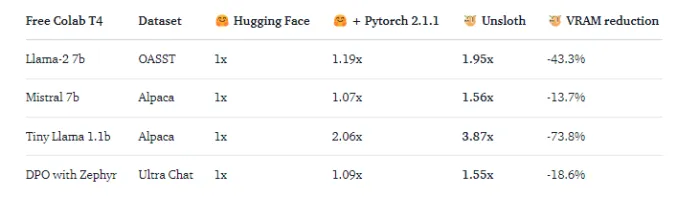

_**Original Source of the blog post: [Budget Instruction Fine-tuning of Llama 3 8B Instruct (on Medical Data) with Hugging Face, Google Colab and Unsloth  ](https://mlops.community/budget-instruction-fine-tuning-of-llama-3-8b-instructon-medical-data-with-hugging-face-google-colab-and-unsloth/)**_

Many contemporary LLMs are showing impressive overall performance but often stumble when confronted with specific task-oriented challenges. Fine-tuning provides significant advantages, such as reduced computational costs and the opportunity to harness cutting-edge models without starting from scratch.

Fine-tuning is a process of taking a pre-trained model and further training it on a domain-specific dataset. This process enhances the model’s performance for specific tasks, rendering it more adept and adaptable in real-world scenarios. It is an indispensable step for customizing existing models to address particular tasks or domains effectively.

Despite the relatively lower computational costs of fine-tuning LLMs compared to full training, it still demands significant GPU power. Access to such resources can be a barrier for many enthusiasts. However, Google Colab offers free-tier GPUs, and with efficient memory management facilitated by the Unsloth library, users can successfully fine-tune LLMs on T4 GPUs at no cost.

In this blog post, we delve into explaining some fundamental terms of fine-tuning, exploring different approaches, providing a comprehensive guide on preparing a dataset for instructional fine-tuning focusing on medical data and finishing by fine-tuning a pre-trained instruct/chat version of LLM with 7B/8B parameters(gemma-1.1-7b-it, mistral-7b-instruct-v0.2, llama-2-7b-chat, [llama-3-8b-Instruct-bnb-4bit](https://huggingface.co/Shekswess/llama-3-8b-Instruct-bnb-4bit-medical)). We’ll walk through the fine-tuning process utilizing tools and platforms such as Hugging Face, Unsloth, and Google Colab.

## Exploring the concept of fine-tuning
Before delving into fine-tuning methods, it’s essential to grasp their diverse categories. Fine-tuning approaches for Large Language Models (LLMs) can be categorized based on:

- Data Utilization: The nature of data employed during fine-tuning.
- Weight Adjustment: Whether all or only specific model weights are updated.

### Fine-tuning by Data Utilization
Fine-tuning strategies diverge based on the data utilized, which can be categorized into four distinct types:

- Supervised Fine-tuning
- Few-shot Learning
- Full Transfer Learning
- Domain-specific Fine-tuning

#### Supervised Fine-Tuning
This method represents the standard approach to fine-tuning. The model undergoes further training using a labeled dataset tailored to the specific task it aims to perform, such as text classification, question answering or named entity recognition. For example, in sentiment analysis, the model would be trained on a dataset comprising text samples annotated with their corresponding sentiments.

#### Few-Shot Learning
In scenarios where assembling a sizable labeled dataset proves impractical, few-shot learning steps in to provide a solution. This technique furnishes the model with a handful of examples (or shots) of the desired task at the outset of input prompts. By doing so, the model gains a better contextual understanding of the task without necessitating an exhaustive fine-tuning regimen.

#### Full Transfer Learning
While all fine-tuning methods involve a form of transfer learning, this category specifically enables a model to undertake tasks distinct from its original training objective. The crux lies in leveraging the knowledge amassed by the model from a broad, general dataset and applying it to a more specialized or related task.

#### Domain-Specific Fine-Tuning
This fine-tuning variant aims to acclimate the model to comprehend and generate text pertinent to a particular domain or industry. The model undergoes fine-tuning using a dataset comprising text specific to the target domain, thereby enhancing its contextual grasp and proficiency in domain-specific tasks. For example, to develop a chatbot for a medical application, the model would be trained on medical records to refine its language comprehension abilities within the healthcare domain.

### Fine-tuning by Weight Adjustment
There are two types of fine-tuning depending on which model weights are updated during the process of fine-tuning:

- Full Fine-Tuning (Real Instruction Fine-Tuning)
- Parameter Efficient Fine-Tuning (PEFT)

#### Full Fine Tuning (Real Instruction Fine-Tuning)
Instruction fine-tuning serves as a strategic approach to enhancing a model’s performance across diverse tasks by training it on guiding examples for responding to queries. The selection of the dataset is pivotal and tailored to the specific task at hand, be it summarization or translation. This comprehensive fine-tuning method, often termed as full fine-tuning, involves updating all model weights, resulting in an optimized version. However, it imposes significant demands on memory and computational resources akin to pre-training, necessitating robust infrastructure to manage storage and processing during training.

#### Parameter Efficient Fine-Tuning (PEFT)
Parameter Efficient Fine-Tuning or simply PEFT represents a more resource-efficient alternative to full fine-tuning in instruction fine-tuning methodologies. While full LLM fine-tuning entails substantial computational overhead, posing challenges in memory allocation, PEFT offers a solution by updating only a subset of parameters, effectively “freezing” the remainder. This approach reduces the number of trainable parameters, thus alleviating memory requirements and guarding against catastrophic forgetting. In contrast to full fine-tuning, PEFT preserves the original LLM weights, retaining previously acquired knowledge. This feature proves advantageous for mitigating storage constraints when fine-tuning across multiple tasks. Widely adopted techniques such as Low-Rank Adaptation (LoRA) and  Quantized Low-Rank Adaptation (QLoRA) exemplify effective methods for achieving parameter-efficient fine-tuning.

## What are LoRA & QLoRa ?
**LoRA** is an enhanced fine-tuning approach, which diverges from the conventional method by fine-tuning only two smaller matrices that approximate the weight matrix of the pre-trained large language model, thus forming the LoRA adapter. This fine-tuned adapter is then integrated into the pre-trained model for subsequent inference tasks. Upon completion of LoRA fine-tuning for a specific task or use case, the result is an unchanged original LLM alongside the emergence of a significantly smaller “LoRA adapter,” often constituting a mere fraction of the original LLM’s size (measured in MB rather than GB). During inference, the LoRA adapter must be fused with its original LLM. This approach offers a key advantage: many LoRA adapters can effectively repurpose the original LLM, thus reducing overall memory requirements when handling multiple tasks and use cases.

**QLoRA** represents a further advancement in memory efficiency over LoRA. It refines the LoRA technique by quantizing the weights of the LoRA adapters to lower precision, typically 4-bit instead of the original 8-bit. This additional optimization drastically reduces the memory footprint and storage overhead. In QLoRA, the pre-trained model is loaded into GPU memory with quantized 4-bit weights, a departure from the 8-bit precision utilized in LoRA. Despite this reduction in bit precision, QLoRA maintains a comparable level of effectiveness to its predecessor, demonstrating its prowess in optimizing memory usage without compromising performance.


## Guide for preparing data and fine-tuning of Llama 3 8B Instruct

After learning some of the basics for fine-tuning LLMs, now we can do the actual fine-tuning. In this blogpost we are going to fine-tune the Llama 3 8B Instruct LLM on a custom created medical instruct dataset. If you want to fine-tune any other popular LLM model like Mistral v0.2, Llama 2 or Gemma 1.1, you can check the code on the [GitHub Repository](https://github.com/Shekswess/LLM-Medical-Finetuning) dedicated for this blogpost.

Preparing instruction data for Llama 3 8B Instruct (Optional)
This step of the blogpost(guide) is optional if you already know how to prepare an instructional dataset for fine-tuning a LLM or if you already have an instructional dataset prepared. 

For our guide we are going to work with two publicly available medical datasets which entries are question-answer pairs. The datasets are:

- [Medical meadow wikidoc](https://huggingface.co/datasets/medalpaca/medical_meadow_wikidoc/blob/main/README.md)
- [Medquad](https://www.kaggle.com/datasets/jpmiller/layoutlm)

The idea is to use the question-answer pairs from the both datasets, to create instruction prompts from each pair(using the Llama 3 Instruct template), to convert the newly created instruction datasets to Hugging Face datasets, to combine them to create one big medical instruction dataset and to create one smaller version of the bigger medical instruction dataset.

We must know the prompt instruction template used by Llama 3 so we can fully utilize the Llama 3 8B Instruct. The template is:

```
<|start_header_id|>system<|end_header_id|>

{{ system_prompt }}<|eot_id|><|start_header_id|>user<|end_header_id|>

{{ input }}<|eot_id|><|start_header_id|>assistant<|end_header_id|>

{{ output }}<|eot_id|>
```

Note that “<|start_header_id|>”,”<|end_header_id|>” and “<|eot_id|>” are special tokens.

First we need to define the preprocessing of the datasets, we need to rename some columns so the both datasets are uniformed, drop some unused columns, remove duplicate or NaN rows, add instruction for each entry and create instruct prompt for each entry in the datasets. This code can be found in the `src/data_processing/instruct_datasets.py`

```python
from abc import ABC, abstractmethod

import pandas as pd


class InstructDataset(ABC):
    """
    Abstract class for creating Instruct Datasets
    """

    def __init__(self, dataset_path: str):
        """
        Initialize the dataset
        :param dataset_path: The path to the dataset
        """
        self.dataset = None
        self.load_dataset(dataset_path)

    def load_dataset(self, dataset_path: str) -> None:
        """
        Load the dataset from the given path
        :param dataset_path: The path to the dataset
        :return: None
        """
        self.dataset = pd.read_csv(dataset_path)

    def rename_columns(self, columns: dict[str, str]) -> None:
        """
        Rename the columns of the dataset
        :param columns: A dictionary of the form {old_name: new_name}
        :return: None
        """
        self.dataset = self.dataset.rename(columns=columns)

    def drop_columns(self, columns: list[str]) -> None:
        """
        Drop the columns from the dataset
        :param columns: A list of column names to drop
        :return: None
        """
        drop_columns = [col for col in columns if col in self.dataset.columns]
        self.dataset = self.dataset.drop(columns=drop_columns)

    def drop_bad_rows(self, columns: list[str]) -> None:
        """
        Drop the rows which have bad values in the columns
        :param columns: A list of columns to check for bad values
        :return: None
        """
        self.dataset = self.dataset.dropna(subset=columns)
        self.dataset = self.dataset.drop_duplicates(subset=columns)

    def create_instruction(self, instruction: str) -> None:
        """
        Create an instruction column in the dataset
        :param instruction: The instruction to add to the dataset
        :return: None
        """
        self.dataset["instruction"] = instruction

    @abstractmethod
    def create_prompt(self) -> None:
        """
        Create the prompt column in the dataset
        :return: None
        """
        pass

    def get_dataset(self) -> pd.DataFrame:
        """
        Get the dataset
        :return: The dataset
        """
        return self.dataset


class Llama3InstructDataset(InstructDataset):

    def create_prompt(self):
        """
        Create the prompt column in the dataset which will be used for
        """
        prompts = []
        for index, row in self.dataset.iterrows():
            prompt = f"""<|start_header_id|>system<|end_header_id|> {row['instruction']}<|eot_id|><|start_header_id|>user<|end_header_id|> This is the question: {row['input']}<|eot_id|><|start_header_id|>assistant<|end_header_id|> {row['output']}<|eot_id|>"""
            prompts.append(prompt)
        self.dataset["prompt"] = prompts
```

After defining the code needed for preprocessing the datasets we are going to write an script that will trigger the preprocessing of the datasets, create instruction datasets from them, create Hugging Face datasets for each particular dataset, merge them into one bigger dataset (also available as Hugging Face dataset) and create a smaller one with 2k entries from the bigger dataset. This code can be found in the `src/data_processing/create_process_datasets.py`

```python
import logging
import os

import pandas as pd
from datasets import Dataset, DatasetDict
from instruct_datasets import (
    MistralInstructDataset,
)

REMOVE_COLUMNS = ["source", "focus_area"]
RENAME_COLUMNS = {"question": "input", "answer": "output"}
INSTRUCTION = "Answer the question truthfully, you are a medical professional."
DATASETS_PATHS = [       "LLM-Medical-Finetuning\data\raw_data\medical_meadow_wikidoc.csv",
"LLM-Medical-Finetuning\data\raw_data\medquad.csv",
]

logger = logging.getLogger(__name__)
logger.setLevel(logging.INFO)


def process_dataset(dataset_path: str) -> pd.DataFrame:
    """
    Process the instruct dataset to be in the format required by the model.
    :param dataset_path: The path to the dataset.
    :param model: The model to process the dataset for.
    :return: The processed dataset.
    """
    logger.info(f"Processing dataset: {dataset_path}.")
    dataset.drop_columns(REMOVE_COLUMNS)
    logger.info("Columns removed!")
    dataset.rename_columns(RENAME_COLUMNS)
    logger.info("Columns renamed!")
    dataset.create_instruction(INSTRUCTION)
    logger.info("Instructions created!")
    dataset.drop_bad_rows(["input", "output"])
    logger.info("Bad rows dropped!")
    dataset.create_prompt()
    logger.info("Prompt column created!")
    return dataset.get_dataset()


def create_dataset_hf(
    dataset: pd.DataFrame,
) -> DatasetDict:
    """
    Create a Hugging Face dataset from the pandas dataframe.
    :param dataset: The pandas dataframe.
    :return: The Hugging Face dataset.
    """
    dataset.reset_index(drop=True, inplace=True)
    return DatasetDict({"train": Dataset.from_pandas(dataset)})


if __name__ == "__main__":
    processed_data_path = "LLM-Medical-Finetuning\data\processed_data"
    os.makedirs(processed_data_path, exist_ok=True)

    llama3_datasets = []

    for dataset_path in DATASETS_PATHS:
        dataset_name = dataset_path.split(os.sep)[-1].split(".")[0]

        llama3_dataset = process_dataset(dataset_path)

        llama3_datasets.append(mistral_dataset)

        llama3_dataset = create_dataset_hf(mistral_dataset)

        llama3_dataset.push_to_hub(f"llama3_{dataset_name}_instruct_dataset")

    llama3_dataset = pd.concat(llama3_datasets, ignore_index=True)

    llama3_dataset = create_dataset_hf(llama3_dataset)

    llama3_dataset.save_to_disk(
        os.path.join(processed_data_path, "medical_llama3_instruct_dataset")
    )

    llama3_dataset.push_to_hub("medical_llama3_instruct_dataset")

    # Smaller dataset for free colab training
    llama3_dataset_short = pd.concat(llama3_datasets, ignore_index=True)

    llama3_dataset_short = pd.concat(
        [llama3_dataset_short.iloc[:1000], llama3_dataset_short.iloc[-5000:-4000]],
        ignore_index=True,
    )

    llama3_dataset_short = create_dataset_hf(llama3_dataset_short)


    llama3_dataset_short.save_to_disk(
        os.path.join(processed_data_path,           "medical_llama3_instruct_dataset_short")
    )


    llama3_dataset_short.push_to_hub("medical_llama3_instruct_dataset_short")
```

After successfully creating the instruct datasets, we can continue to fine-tune the Llama 3 8B Instruct. Instruct datasets created with this code can be found on my Hugging Face Hub, in the collection [Medical Instruct Datasets](https://huggingface.co/collections/Shekswess/medical-instruct-dataset-661c3e8df6402024995f0075).

## Fine-tuning Llama 3 8B Instruct

### Step 0: Creating Google Colab Notebook and selecting correct runtime
To start to fine-tune the Llama 3 8B Instruct we first need to create a Colab Notebook on Google Colab. One option is to create a new Google Colab Notebook (1) and use the code available on this blogpost or another approach is to open the Google Colab Notebook from the GitHub Repository on which all the code is available and already written (2).


_**Creating new blank Colab Notebook or opening already written**_


After successfully creating/opening of Google Colab Notebook, the next step is to execute the code blocks which will fine-tune our LLM. But before we start executing the code blocks, we must assure that we have selected the T4 Colab GPU(or any other).


_**Selecting the T4 GPU runtime type**_

### Step 1: Installing necessary packages (libraries) for the fine-tuning
The first step is to install all the necessary packages for the execution. We are going to install [xformers](https://github.com/facebookresearch/xformers) for the transformer layers, [trl](https://github.com/huggingface/trl) for training the transformers(LLMs), [peft](https://github.com/huggingface/peft) for the Parameter Efficient Fine Tuning, [accelerate](https://github.com/huggingface/accelerate) to enable the GPU to be used in the whole execution, [bitsandbytes](https://github.com/TimDettmers/bitsandbytes) for quantization the usage of 4 bit and unsloth allowing us to operate efficiently with minimal memory usage during the fine-tuning, basically the feature which allows us to fine-tune on T4 Google Colab GPU. Analyzing the benchmarks provided by [unsloth](https://github.com/unslothai/unsloth) on the [blog post](https://huggingface.co/blog/unsloth-trl) shared on Hugging Face, it can be concluded that using unsloth can provide memory savings from 13.7% to 73.8%.


_**Benchmark provided by Unsloth*_


The code for installing the necessary packages for the fine-tuning:

```python
# Installing all the necessary packages(libraries) for the experiments (V100, T4, RTX20xx)
!pip install --no-deps xformers trl peft accelerate bitsandbytes
!pip install "unsloth[colab-new] @ git+https://GitHub.com/unslothai/unsloth.git"
```

### Step 2: Importing the installed packages (libraries)
After installing all the necessary packages we need to import them so they can be used for the process of fine-tuning the LLM.

```python
# Importing the necessary packages(libraries) for the experiments
import json
import torch
from datasets import load_dataset
from huggingface_hub import notebook_login
from transformers import TrainingArguments
from trl import SFTTrainer
from unsloth import FastLanguageModel
```

### Step 3: Log in to the Hugging Face Hub
The next step is to login to Hugging Face Hub by using a read/write access token([click here](https://huggingface.co/docs/hub/en/security-tokens) to see how to create one) so later we can upload the fine-tuned model.

```python
# Logging into the Hugging Face Hub(with token)
notebook_login()
```

### Step 4: Creating the config
This is the most crucial step, to create the config which will be used to know what is the base model, what will be the name of the new fine-tuned model, what is the data type of the values of the matrices, the lora config(rank, target modules, alpha, dropout, etc..), what is the dataset used for  fine-tuning, the config for the training job (hyperparams). To learn more about how to do hyperparameter tuning for LoRA/QLoRA you can read more [here](https://lightning.ai/pages/community/lora-insights/#toc13).

```python
# Defining the configuration for the base model, LoRA and training
config = {
    "hugging_face_username":"Shekswess",
    "model_config": {
        "base_model":"unsloth/llama-3-8b-Instruct-bnb-4bit", # The base model
        "finetuned_model":"llama-3-8b-Instruct-bnb-4bit-medical", # The fine-tuned model
        "max_seq_length": 2048, # The maximum sequence length
        "dtype":torch.float16, # The data type
        "load_in_4bit": True, # Load the model in 4-bit
    },
    "lora_config": {
      "r": 16, # The number of LoRA layers 8, 16, 32, 64
      "target_modules": ["q_proj", "k_proj", "v_proj", "o_proj",
                      "gate_proj", "up_proj", "down_proj"], # The target modules
      "lora_alpha":16, # The alpha value for LoRA
      "lora_dropout":0, # The dropout value for LoRA
      "bias":"none", # The bias for LoRA
      "use_gradient_checkpointing":True, # Use gradient checkpointing
      "use_rslora":False, # Use RSLora
      "use_dora":False, # Use DoRa
      "loftq_config":None # The LoFTQ configuration
    },
    "training_dataset":{
        "name":"Shekswess/medical_llama3_instruct_dataset_short", # The dataset name(huggingface/datasets)
        "split":"train", # The dataset split
        "input_field":"prompt", # The input field
    },
    "training_config": {
        "per_device_train_batch_size": 2, # The batch size
        "gradient_accumulation_steps": 4, # The gradient accumulation steps
        "warmup_steps": 5, # The warmup steps
        "max_steps":0, # The maximum steps (0 if the epochs are defined)
        "num_train_epochs": 1, # The number of training epochs(0 if the maximum steps are defined)
        "learning_rate": 2e-4, # The learning rate
        "fp16": not torch.cuda.is_bf16_supported(), # The fp16
        "bf16": torch.cuda.is_bf16_supported(), # The bf16
        "logging_steps": 1, # The logging steps
        "optim" :"adamw_8bit", # The optimizer
        "weight_decay" : 0.01,  # The weight decay
        "lr_scheduler_type": "linear", # The learning rate scheduler
        "seed" : 42, # The seed
        "output_dir" : "outputs", # The output directory
    }
}
```

### Step 5: Loading model, tokenizer, configuration for LoRA(QLoRA), dataset, and trainer
In the next step we are loading the model and the tokenizer for the model, we are configuring the LoRA(QLoRA) configuration, loading the training (fine-tuning) dataset and configuring the trainer all by using the previously setup config variable.

```python
# Loading the model and the tokinizer for the model
model, tokenizer = FastLanguageModel.from_pretrained(
    model_name = config.get("model_config").get("base_model"),
    max_seq_length = config.get("model_config").get("max_seq_length"),
    dtype = config.get("model_config").get("dtype"),
    load_in_4bit = config.get("model_config").get("load_in_4bit"),
)

# Setup for QLoRA/LoRA peft of the base model
model = FastLanguageModel.get_peft_model(
    model,
    r = config.get("lora_config").get("r"),
    target_modules = config.get("lora_config").get("target_modules"),
    lora_alpha = config.get("lora_config").get("lora_alpha"),
    lora_dropout = config.get("lora_config").get("lora_dropout"),
    bias = config.get("lora_config").get("bias"),
    use_gradient_checkpointing = config.get("lora_config").get("use_gradient_checkpointing"),
    random_state = 42,
    use_rslora = config.get("lora_config").get("use_rslora"),
    use_dora = config.get("lora_config").get("use_dora"),
    loftq_config = config.get("lora_config").get("loftq_config"),
)

# Loading the training dataset
dataset_train = load_dataset(config.get("training_dataset").get("name"), split = config.get("training_dataset").get("split"))

# Setting up the trainer for the model
trainer = SFTTrainer(
    model = model,
    tokenizer = tokenizer,
    train_dataset = dataset_train,
    dataset_text_field = config.get("training_dataset").get("input_field"),
    max_seq_length = config.get("model_config").get("max_seq_length"),
    dataset_num_proc = 2,
    packing = False,
    args = TrainingArguments(
        per_device_train_batch_size = config.get("training_config").get("per_device_train_batch_size"),
        gradient_accumulation_steps = config.get("training_config").get("gradient_accumulation_steps"),
        warmup_steps = config.get("training_config").get("warmup_steps"),
        max_steps = config.get("training_config").get("max_steps"),
        num_train_epochs= config.get("training_config").get("num_train_epochs"),
        learning_rate = config.get("training_config").get("learning_rate"),
        fp16 = config.get("training_config").get("fp16"),
        bf16 = config.get("training_config").get("bf16"),
        logging_steps = config.get("training_config").get("logging_steps"),
        optim = config.get("training_config").get("optim"),
        weight_decay = config.get("training_config").get("weight_decay"),
        lr_scheduler_type = config.get("training_config").get("lr_scheduler_type"),
        seed = 42,
        output_dir = config.get("training_config").get("output_dir"),
    ),
)
```

### Step 6: Initializing the training(fine-tuning)
Firstly we want to check the memory usage(statistics) before we start the process of training(fine-tuning). 

```python
# Memory statistics before training
gpu_statistics = torch.cuda.get_device_properties(0)
reserved_memory = round(torch.cuda.max_memory_reserved() / 1024**3, 2)
max_memory = round(gpu_statistics.total_memory / 1024**3, 2)
print(f"Reserved Memory: {reserved_memory}GB")
print(f"Max Memory: {max_memory}GB")

Now is the moment to start training(fine-tuning) the model on the medical instruct dataset.

# Training the model
trainer_stats = trainer.train()

Now we can check the memory usage after the training process.

# Memory statistics after training
used_memory = round(torch.cuda.max_memory_allocated() / 1024**3, 2)
used_memory_lora = round(used_memory - reserved_memory, 2)
used_memory_persentage = round((used_memory / max_memory) * 100, 2)
used_memory_lora_persentage = round((used_memory_lora / max_memory) * 100, 2)
print(f"Used Memory: {used_memory}GB ({used_memory_persentage}%)")
print(f"Used Memory for training(fine-tuning) LoRA: {used_memory_lora}GB ({used_memory_lora_persentage}%)")
```

### Step 7: Saving the trainer stats and the model
After fine-tuning the model we need to keep track of the trainer_stats(time required for the training job, training loss, etc…).

```python
# Saving the trainer stats
with open("trainer_stats.json", "w") as f:
    json.dump(trainer_stats, f, indent=4)

We are going to save the fine-tuned model locally(on the Google Colab Notebook environment) and on our Hugging Face Hub.

# Locally saving the model and pushing it to the Hugging Face Hub (only LoRA adapters)
model.save_pretrained(config.get("model_config").get("finetuned_model"))
model.push_to_hub(config.get("model_config").get("finetuned_model"), tokenizer = tokenizer)

There are multiple different ways of saving our models with different quantization methods.

# Saving the model using merged_16bit(float16), merged_4bit(int4) or quantization options(q8_0, q4_k_m, q5_k_m)...

model.save_pretrained_merged(config.get("model_config").get("finetuned_model"), tokenizer, save_method = "merged_16bit",)
model.push_to_hub_merged(config.get("model_config").get("finetuned_model"), tokenizer, save_method = "merged_16bit")

model.save_pretrained_merged(config.get("model_config").get("finetuned_model"), tokenizer, save_method = "merged_4bit",)
model.push_to_hub_merged(config.get("model_config").get("finetuned_model"), tokenizer, save_method = "merged_4bit")

model.save_pretrained_gguf(config.get("model_config").get("finetuned_model"), tokenizer)
model.push_to_hub_gguf(config.get("model_config").get("finetuned_model"), tokenizer)

model.save_pretrained_gguf(config.get("model_config").get("finetuned_model"), tokenizer, quantization_method = "f16")
model.push_to_hub_gguf(config.get("model_config").get("finetuned_model"), tokenizer, quantization_method = "f16")

model.save_pretrained_gguf(config.get("model_config").get("finetuned_model"), tokenizer, quantization_method = "q4_k_m")
model.push_to_hub_gguf(config.get("model_config").get("finetuned_model"), tokenizer, quantization_method = "q4_k_m")
```

#### Step 8: Loading the fine-tuned model and running inference
Now we can test and run an inference on the fine-tuned model by executing this code block.

```python
# Loading the fine-tuned model and the tokenizer for inference
model, tokenizer = FastLanguageModel.from_pretrained(
        model_name = config.get("model_config").get("finetuned_model"),
        max_seq_length = config.get("model_config").get("max_seq_length"),
        dtype = config.get("model_config").get("dtype"),
        load_in_4bit = config.get("model_config").get("load_in_4bit"),
    )

# Using FastLanguageModel for fast inference
FastLanguageModel.for_inference(model)

# Tokenizing the input and generating the output
inputs = tokenizer(
[
    "<|start_header_id|>system<|end_header_id|> Answer the question truthfully, you are a medical professional.<|eot_id|><|start_header_id|>user<|end_header_id|> This is the question: Can you provide an overview of the lung's squamous cell carcinoma?<|eot_id|>"
"
], return_tensors = "pt").to("cuda")
outputs = model.generate(**inputs, max_new_tokens = 256, use_cache = True)
tokenizer.batch_decode(outputs, skip_special_tokens = True)
```

Congratulations, now we have successfully instruction fine-tuned LLM with 7B parameters on medical data (dataset). All the models that are fine-tuned using these medical datasets and this code,  can be found on my Hugging Face Hub, in the collection Medical Instruct Models. 

### Optional Step: Evaluation of the fine-tuned model
There are multiple ways of evaluating LLMs. Usually when the LLM is fine-tuned on specific domain data, like in our case on medical instruction data(questions and answers), crucial is to have good evaluation. That task is mostly manual, when inference is triggered for multiple questions and the answers are analyzed by a human evaluator(in this case a person with medical background). However if we know the output for specific questions, we can do some other approach of evaluating, like analyzing n-grams(sequence of words) by comparing the output and the ground truth. For this kind of evaluation we can use different metrics(scores) like: ROUGE, BLEU, METEOR, etc. Another alternative is to use the Open LLM Leaderboard and evaluate the LLM by submitting it on the Open LLM Leaderboard. More information about it can be found here.

## Conclusion
As seen from the graph showing the memory usage over time, unsloth provides extremely efficient memory usage which allows us to fine-tune many open-source LLMs. It needs only 5.67GB to load the LLM(Llama 3 8B Instruct) on the VRAM and needs 4.2GB for the PEFT by utilizing the LoRA(QLoRA) method. So basically the whole execution only uses 66% of the available memory(VRAM) or more strictly for the fine-tuning part it uses only 28% of the available memory(VRAM).


_**Memory usage over the whole execution**_

In conclusion, the process of fine-tuning LLMs stands as a crucial step towards harnessing the full potential of pre-trained models for specific tasks and domains. Despite the challenges posed by computational resources, solutions such as Google Colab’s free-tier GPUs and memory management tools like Unsloth pave the way for enthusiasts to engage in this transformative process without financial barriers.

## Resources
- [Code available on GitHub Repository](https://github.com/Shekswess/LLM-7B-Medical-Finetuning)
- [Medical Instruct Datasets](https://huggingface.co/collections/Shekswess/medical-instruct-dataset-661c3e8df6402024995f0075)
- [Medical Instruct Models](https://huggingface.co/collections/Shekswess/medical-instruct-models-661c3f3fc1b5b96446284eaf)
- [Hugging Face](https://huggingface.co/)
- [Google Colab](https://colab.research.google.com/)
- [Unsloth](https://unsloth.ai/about)
- [More about Unsloth](https://huggingface.co/blog/unsloth-trl)
- [More about LoRA](https://arxiv.org/abs/2106.09685)
- [More about QLoRA](https://arxiv.org/abs/2305.14314)
- [More about hyperparameter tuning for LoRA/QLoRA](https://lightning.ai/pages/community/lora-insights/#toc13)
- [More about evaluation using ROUGE(and similar metrics)](https://klu.ai/glossary/rouge-score)