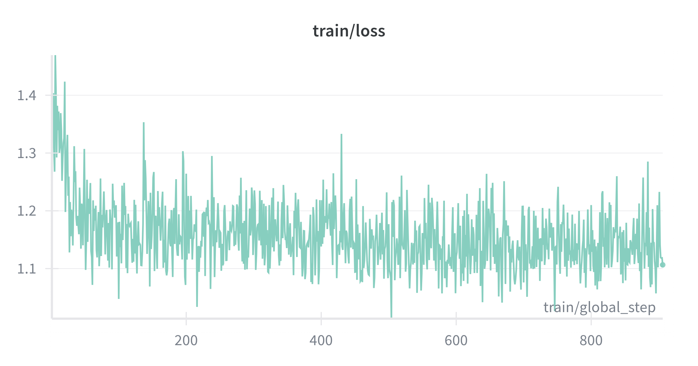

Over the past year, the AI community has witnessed a wave of breakthroughs in reasoning-capable language models. Among these, DeepSeek R1 [1] marked a major milestone, proving that with the right approach and setup, language models can handle complex reasoning tasks. Its release sparked a “reasoning boom,” as researchers began exploring ways to imbue models of all sizes with structured reasoning. This movement has started to close the gap between large language models (LLMs) from frontier labs and smaller models that can be trained and deployed on consumer-grade hardware—small language models (SLMs).

Inspired by that momentum, the Tiny Reasoning Language Model (trlm) project asks a bold question:

 _Can tiny language models reason?_

If DeepSeek R1 showed that reasoning is possible in large models, perhaps a well-designed post-training process can allow a 135M-parameter model to carry out multi-step reasoning in a stable, explainable way.

Recent research gives hope to this ambition. The approach showcased with Tiny Recursion Model (TRM) [2] demonstrates that recursion enables reasoning even in extremely compact networks. Similarly, Tina: Tiny Reasoning Models via LoRA [3], introduces a parameter-efficient RL-based approach that imbues reasoning ability via low-rank adaptation. Finally, MobileLLM-R1 [4] demonstrates that careful data curation and post-training design can push reasoning capabilities into the sub-billion-parameter regime.

This report presents trlm in three deliberate stages: teaching a 135M model to talk, to think (with &lt;think&gt; traces), and finally to prefer good reasoning via alignment. Along the way, it surfaces challenges, surprises, and insights that emerged from compressing reasoning behaviors into a tiny compact language model.

## Methods of Experimentation

The trlm pipeline is structured as a curriculum. Rather than relying on emergent behavior, the approach progressively teaches a tiny model how to converse, how to express structured thinking, and how to prefer better thoughts and answers. See Figure 1 for an overview.

<figure>
  
  <figcaption>Figure 1: trlm training pipeline across three stages <br/>(SFT → SFT (Think) → DPO).</figcaption>
</figure>

Stage 1 performs supervised fine‑tuning on instruction following, summarization, rewriting, and everyday conversation without any chain‑of‑thought. The objective is to stabilize the conversational prior so the model follows directions and produces coherent outputs without hidden thoughts leaking into answers.

Stage 2 introduces explicit reasoning using &lt;think&gt;...&lt;/think&gt; segments. The tokenizer is augmented with special tokens for &lt;think&gt; and &lt;/think&gt;, and the chat template is adjusted so the model produces well‑formed thought segments when the prompt or data indicates a reasoning task. This turns reasoning into a first‑class language the model can reliably speak.

Stage 3 aligns preferences over reasoning styles with Direct Preference Optimization. Training uses chosen versus rejected pairs so the policy learns to prefer concise and correct traces and answers over meandering or incorrect ones. At this parameter scale, alignment functions as a strong style and quality filter.

The central question is straightforward: if a 135M model is explicitly taught to structure its thoughts and then rewarded for better reasoning, will those patterns persist and generalize beyond the training blend? To answer this, each stage is monitored with training curves, qualitative trace reviews, and quantitative evaluations on reasoning benchmarks. But first let’s examine the datasets and preparation pipeline.

## Datasets and Preparation Pipeline

Three curated blends were built, one per stage, with a preparation pipeline that streams sources, caps entries per dataset when needed, normalizes schemas, and tracks provenance with _\_source_dataset_, _\_source_subset_, and _\_source_split_. For throughput, large sources are sharded to parquet while smaller corpora remain in compact JSON. Each final dataset includes a generated card and may be pushed to the Hub.

Stage 1 is a non‑reasoning SFT blend published as _Shekswess/trlm-sft-stage-1-final-2_ with roughly 58k dialogues. The dominant share comes from SmolTalk2 instruction‑following and short form tasks without hidden thoughts. The largest contributor is _smol_magpie_ultra_no_think_ at about 57.8 percent, followed by summarize and rewrite variants at 12.9 percent each, with the remainder from everyday conversations and system chats. This mix intentionally biases toward clarity and compliance rather than long chains. Table 1 summarizes the Stage 1 composition.

<p class="table-title">Table 1: Stage 1 SFT blend composition (non‑reasoning)</p>

| Source (subset)                                                                | Samples | Share |
| ------------------------------------------------------------------------------ | ------: | ----: |
| HuggingFaceTB/smoltalk2 / smoltalk_smollm3_smol_magpie_ultra_no_think          |  33,500 | 57.8% |
| HuggingFaceTB/smoltalk2 / smoltalk_smollm3_smol_summarize_no_think             |   7,500 | 12.9% |
| HuggingFaceTB/smoltalk2 / smoltalk_smollm3_smol_rewrite_no_think               |   7,500 | 12.9% |
| HuggingFaceTB/smoltalk2 / smoltalk_smollm3_systemchats_30k_no_think            |   2,500 |  4.3% |
| HuggingFaceTB/smoltalk2 / smoltalk_smollm3_explore_instruct_rewriting_no_think |   2,500 |  4.3% |
| HuggingFaceTB/smoltalk2 / tulu_3_sft_personas_instruction_following_no_think   |   2,500 |  4.3% |
| HuggingFaceTB/smoltalk2 / smoltalk_smollm3_everyday_conversations_no_think     |   2,000 |  3.5% |

Stage 2 is a reasoning SFT blend, _Shekswess/trlm-sft-stage-2-final-2_, with around 78k traces that explicitly include &lt;think&gt; segments. The largest component is _Llama_Nemotron_Post_Training_Dataset_reasoning_r1_ at 51.5 percent, complemented by OpenThoughts3 at 25.6 percent, multi‑turn reasoning prompts at 12.8 percent, and Qwen3‑generated traces at 6.4 percent. _chat_template_kwargs_ are dropped across sources to keep the schema uniform. The intent is to make reasoning a consistent language, not an artifact of formatting. Table 2 summarizes the Stage 2 composition.

<p class="table-title">Table 2: Stage 2 SFT blend composition <br/>(reasoning CoT traces with &lt;think&gt;)</p>

| Source (subset)                                                             | Samples | Share |
| --------------------------------------------------------------------------- | ------: | ----: |
| HuggingFaceTB/smoltalk2 / Llama_Nemotron_Post_Training_Dataset_reasoning_r1 |  40,200 | 51.5% |
| HuggingFaceTB/smoltalk2 / OpenThoughts3_1.2M                                |  20,000 | 25.6% |
| HuggingFaceTB/smoltalk2 / multi_turn_reasoning_if_think                     |  10,000 | 12.8% |
| HuggingFaceTB/smoltalk2 / aya_dataset_Qwen3_32B_think                       |   5,000 |  6.4% |
| HuggingFaceTB/smoltalk2 / smoltalk_everyday_convs_reasoning_Qwen3_32B_think |   2,000 |  2.6% |
| HuggingFaceTB/smoltalk2 / s1k_1.1_think                                     |     800 |  1.0% |

Stage 3 is the preference alignment dataset, _Shekswess/trlm-dpo-stage-3-final-2_, constructed around 50k chosen versus rejected pairs from _olmo-3-preference-mix-deltas_ variants. Legacy metadata is normalized and _dataset_ is renamed to _source_ for consistency with earlier stages. These pairs focus on reasoning quality rather than only surface‑level helpfulness. Table 3 summarizes the Stage 3 dataset.

<p class="table-title">Table 3: Stage 3 DPO dataset (chosen vs rejected pairs)</p>

| Source (split)                                                                            | Samples | Notes                                                 |
| ----------------------------------------------------------------------------------------- | ------: | ----------------------------------------------------- |
| scottgeng00/olmo-3-preference-mix-deltas_reasoning-yolo_scottmix-DECON-chfiltered / train |  50,000 | Drops legacy metadata, renames _dataset_ to _source_. |

This staged strategy allows the model to learn to converse first, then to think explicitly with correct delimiters, and finally to prefer better reasoning patterns. Now let’s examine the training setup.

## Training Setup and Configuration

All stages fine‑tune SmolLM2‑135M‑Instruct [5] by doing full supervised fine-tuning. Training was run on a single AMD MI300x instance, with artifacts saved regularly and public checkpoints pushed at the end of each stage: _Shekswess/trlm-stage-1-sft-final-2_, _Shekswess/trlm-stage-2-sft-final-2_, and _Shekswess/trlm-stage-3-dpo-final-2_. For Stage 2 onward, the tokenizer is extended with &lt;think&gt; and &lt;/think&gt; as special tokens and a chat template is enforced where thoughts appear inside &lt;think&gt; tags and the final answer appears outside. This discipline keeps traces readable and reduces leakage of internal steps into answers.

Optimization is straightforward. Stage 1 and Stage 2 use standard supervised fine‑tuning with a schedule tuned for stability on a tiny backbone. Stage 3 switches to the DPO objective with per‑batch chosen and rejected completions. Checkpoints are saved roughly every 300 steps while monitoring loss, token accuracy, entropy, reward margins, and chosen versus rejected dynamics. Let's review the training curves and configurations for each stage.

### Stage 1 - SFT without chain‑of‑thought

<figure>
  
  <figcaption>Figure 2: Stage 1 SFT training loss over optimization steps.</figcaption>
  </figure>

<figure>
  
  <figcaption>Figure 3: Stage 1 SFT mean token accuracy.</figcaption>
</figure>

<figure>
  
  <figcaption>Figure 4: Stage 1 SFT output entropy.</figcaption>
</figure>

As shown in Figure 2, the loss decreases smoothly and then stabilizes, indicating the tiny model reliably learns general instruction following without special treatment for thoughts. Token accuracy climbs with small oscillations typical of a diverse short‑form mix (Figure 3). Entropy trends downward before settling, consistent with a compact model becoming confident without becoming brittle (Figure 4). This establishes a solid conversational foundation which Stage 2 can build upon with the introduction of CoT reasoning capabilities.

<p class="table-title">Table 4: Stage 1 SFT training configuration</p>

| Parameter              | Value                                          |
| ---------------------- | ---------------------------------------------- |
| Base model             | _HuggingFaceTB/SmolLM2-135M-Instruct_          |
| Tokenizer              | _HuggingFaceTB/SmolLM2-135M-Instruct_          |
| Dataset                | _Shekswess/trlm-sft-stage-1-final-2_ (_train_) |
| Epochs                 | 3                                              |
| Per-device batch size  | 32                                             |
| Gradient accumulation  | 4                                              |
| Gradient checkpointing | true                                           |
| Learning rate          | 3e-4                                           |
| Weight decay           | 0.01                                           |
| Warmup ratio           | 0.1                                            |
| Max grad norm          | 1.0                                            |
| Loss                   | dft                                            |
| Max length             | 4096                                           |
| Scheduler              | cosine                                         |
| NEFTune noise alpha    | 0.01                                           |

### Stage 2 - SFT with &lt;think&gt; reasoning

<figure>
  
  <figcaption>Figure 5: Stage 2 SFT training loss with explicit &lt;think&gt; supervision.</figcaption>
</figure>

<figure>
  
  <figcaption>Figure 6: Stage 2 SFT mean token accuracy.</figcaption>
</figure>

<figure>
  
  <figcaption>Figure 7: Stage 2 SFT output entropy.</figcaption>
</figure>

Introducing &lt;think&gt; CoT segments increases task difficulty. Training remains well‑behaved and converges without collapse (Figure 5). Accuracy stabilizes slightly below Stage 1, matching the added difficulty and longer targets when thoughts are present (Figure 6). Entropy stays in a healthy range, suggesting exploration inside &lt;think&gt; tags with decisive answers outside (Figure 7). Notably, the model learns to use &lt;think&gt; as a structured language, producing readable multi‑step traces that align with prompts. However some malformed traces appear, indicating room for further refinement in formatting and data curation, which also motivates Stage 3 alignment.

<p class="table-title">Table 5: Stage 2 SFT training configuration</p>

| Parameter              | Value                                          |
| ---------------------- | ---------------------------------------------- |
| Base model             | _Shekswess/trlm-stage-1-sft-final-2_           |
| Tokenizer              | _Shekswess/trlm-stage-1-sft-final-2_           |
| Special tokens         | &lt;think&gt;, &lt;/think&gt;                  |
| Dataset                | _Shekswess/trlm-sft-stage-2-final-2_ (_train_) |
| Epochs                 | 1                                              |
| Per-device batch size  | 32                                             |
| Gradient accumulation  | 4                                              |
| Gradient checkpointing | true                                           |
| Learning rate          | 3e-4                                           |
| Weight decay           | 0.02                                           |
| Warmup ratio           | 0.1                                            |
| Max grad norm          | 1.0                                            |
| Max length             | 4096                                           |
| Scheduler              | cosine                                         |
| NEFTune noise alpha    | 0.02                                           |

### Stage 3 - DPO alignment of reasoning quality

<figure>
  
  <figcaption>Figure 8: Stage 3 DPO training loss.</figcaption>
</figure>

<figure>
  
  <figcaption>Figure 9: Stage 3 DPO rewards accuracies.</figcaption>
</figure>

<figure>
  
  <figcaption>Figure 10: Stage 3 DPO reward margins showing separation over time.</figcaption>
</figure>

With DPO the loss variance drops after a short warm‑up (Figure 8), and chosen versus rejected rewards separate with widening margins (Figure 9 and Figure 10). Over time the policy prefers cleaner traces and more decisive answers. The chosen and rejected log‑prob dynamics form a consistent signal without overfitting to any single prompt template. After some test interactions, the model produces notably more concise and correct reasoning traces, indicating that even at 135M parameters, preference alignment effectively shapes reasoning style and quality.

<p class="table-title">Table 6: Stage 3 DPO training configuration</p>

| Parameter              | Value                                          |
| ---------------------- | ---------------------------------------------- |
| Base model             | _Shekswess/trlm-stage-2-sft-final-2_           |
| Tokenizer              | _Shekswess/trlm-stage-2-sft-final-2_           |
| Dataset                | _Shekswess/trlm-dpo-stage-3-final-2_ (_train_) |
| Epochs                 | 1                                              |
| Per-device batch size  | 32                                             |
| Gradient accumulation  | 4                                              |
| Gradient checkpointing | true                                           |
| Learning rate          | 1e-5                                           |
| Weight decay           | 0.01                                           |
| Warmup ratio           | 0.1                                            |
| Max grad norm          | 0.2                                            |
| DPO beta               | 0.1                                            |
| DPO loss               | _apo_zero_                                     |
| Max prompt length      | 1048                                           |
| Max length             | 2048                                           |
| Scheduler              | _cosine_with_min_lr_ (_min_lr_rate=0.1_)       |

## Discussion

Across the three stages a clear capability progression emerges. Stage 1 establishes a strong conversational prior that tiny backbones often lack out of the box. In Stage 2, once the model learns to use &lt;think&gt; as a language, it can carry multi‑step traces that are readable and mostly well‑formed. Stage 3 shifts the distribution of those traces toward helpful, correct, and efficient reasoning rather than rambling.

Three practical lessons emerge. First, delimiters matter. Adding &lt;think&gt; and enforcing a consistent template reduces malformed traces and stabilizes training. Second, curation dominates. The balance among _Llama_Nemotron_, _OpenThoughts_, and multi‑turn synthetic sources tracks closely with the kinds of traces the model reproduces. Third, alignment is a strong lever even at 135M parameters. Preference optimization shifts style and correctness in a way that outweighs the model’s size.

See Figure 10 for an example model interaction trace.

```
<|im_start|>system
You are a helpful AI assistant named Tiny Reasoning Language Model, trained by Shekswess. You are an assistant, with the ability to do reasoning. When performing reasoning always perform your full chain of thought inside <think>...</think> before giving a final answer. You are always reasoning so always use <think> </think> tags.<|im_end|>

<|im_start|>user
In this task, we ask you to write an implausible answer to a question that involves "transient v. stationary" events, i.e., the understanding of whether an event will change over time or not. For example, the sentence "he was born in the U.S." contains a stationary event since it will last forever; however, "he is hungry" contains a transient event since it will remain true for a short period of time. Even though there exist multiple wrong answers, we only need a single wrong answer. Please try to keep your "answer" as simple as possible. Concise and simple "answer" is preferred over those complex and verbose ones.
One example is below.
Q: Sentence: Jack played basketball after school, after which he was very tired.
Question: Was Jack still tired the next day?
A: Yes.
Rationale: Typically fatigue after playing in school goes away the next day. So, "Yes" is an unlikely answer.
Q: Sentence: In the nose, mucus and hairs trap any dust or other particles in the air.
Question: Is the dust still in the mucus?<|im_end|>
<|im_start|>assistant
<think>
Okay, so I need to figure out whether the sentence "In the nose, mucus and hairs trap any dust or other particles in the air" is true. Let me break it down.

First, the sentence says "in the nose, mucus and hairs trap any dust or other particles in the air." Hmm, mucus is a common term, right? It's a protein-like substance that's part of the respiratory tract. The hairs in the nose trap dust particles. So, the explanation for why it's "tightly trapped" is that the hairs in the nose are attached to the mucus, trapping the particles.

The question is whether the dust particles are still there. So, the premise is that the mucus and hairs trap dust particles. But the question is asking if the dust particles are still there. So, the answer is "yes."

But wait, is the dust particles actually still present? If the hairs in the nose are still attached to the mucus, then the dust particles would be trapped by the hairs. But the question is about whether the dust particles are still there. So, the answer is "yes." That's the most straightforward and correct answer.

So the answer is: yes. Let me double-check that. The explanation says the hairs in the nose trap dust particles. So the hairs are attached to the mucus, trapping them. So the dust particles are trapped by the hairs. The answer is "yes."
</think>

The answer to the question: "Is the dust particles still present after the next day?" is "yes." This is the simplest answer because it directly answers the question without any additional information. It is straightforward and directly addresses the question.<|im_end|>
```

_Figure 10: Example output with explicit &lt;think&gt; trace._

There are limits. Hallucinations and brittle steps still appear on hard multi‑turn problems, especially when traces approach the context budget. Stage 2 and Stage 3 were run for a single epoch; multi‑epoch curricula or staged schedules are expected to further improve consistency. The model remains a research prototype and is not suitable for safety‑critical environments.

## Closing thoughts

This study tests the intuition that explicit reasoning plus preference alignment can make tiny models reason in a readable and steerable way. The results support that intuition. While absolute performance trails larger reasoners, a 135M model offers compelling advantages for on‑device helpers, very low‑latency agents, and small specialized copilots. Careful curation, explicit thought formatting, and lightweight alignment together form a practical recipe for compact reasoning.

Future work includes scaling to roughly 250M-300M backbones, multi‑epoch curricula for Stage 2 and Stage 3, exploration of GRPO and related RL methods on top of DPO, and continued pretraining on reasoning‑heavy corpora. Revisiting low‑rank adaptation specifically for tiny backbones is also promising given recent results showing competitive performance without full fine‑tuning.

Would love to experiment more with LoRA on extremely tiny models like trlm, inspired by the excellent "LoRA Without Regret" work from Thinking Machines Lab [8], which can potentially unlock even more efficient reasoning capabilities.

## Acknowledgments

This project was executed by a single researcher with support from the following contributors and resources:

- [@HotAisle](https://x.com/HotAisle) for compute on an AMD MI300x setup;
- [@mkurman88](https://x.com/mkurman88) for ideas, feedback, and code samples;
- [@HuggingFaceTB](https://x.com/HuggingFaceTB) for SmolLM2‑135M‑Instruct and the SmolTalk2 collection;
- [@scottgeng00](https://x.com/scottgeng00) for the OLmO‑3‑Preference‑Mix‑Deltas dataset;
- and [@eliebakouchi](https://x.com/eliebakouchi) for tokenizer guidance that helped keep &lt;think&gt; formatting clean and reliable.

## Resources

- Project repository: [GitHub](https://github.com/Shekswess/tiny-reasoning-language-model)
- Hugging Face Model, Checkpoints, and Datasets Collection: [Hugging Face](https://huggingface.co/collections/Shekswess/tiny-reasoning-language-model)

## Citations

Please cite this work as:

```bibtex
@article{2025trlm,
  title={Can Tiny Language Models Reason?},
  author={Bojan Jakimovski},
  year={2025},
  note={\url{https://shekswess.github.io/tiny-reasoning-language-model.html}}
}
```

## References

1. [Guo et al. DeepSeek‑R1: Incentivizing Reasoning Capability in LLMs via Reinforcement Learning. arXiv:2501.12948, 2025.](https://arxiv.org/abs/2501.12948)
2. [Alexia JoliCoeur‑Martineau. Less is More: Recursive Reasoning with Tiny Networks. arXiv:2510.04871, 2025.](https://arxiv.org/abs/2510.04871)
3. [Wang et al. Tina: Tiny Reasoning Models via LoRA. arXiv:2504.15777, 2025.](https://arxiv.org/abs/2504.15777)
4. [Zhao et al. MobileLLM‑R1: Exploring the Limits of Sub‑Billion Language Model Reasoners with Open Training Recipes. arXiv:2509.24945, 2025.](https://arxiv.org/abs/2509.24945)
5. [Ben Allal et al. SmolLM2: Data‑centric training of a small language model. arXiv:2502.02737, 2025.](https://arxiv.org/abs/2502.02737)
6. [Yu et al. Long‑Short Chain‑of‑Thought Mixture Supervised Fine‑Tuning. arXiv:2505.03469, 2025.](https://arxiv.org/abs/2505.03469)
7. [Rafailov et al. Direct Preference Optimization: Your Language Model is Secretly a Reward Model. arXiv:2305.18290, 2023.](https://arxiv.org/abs/2305.18290)
8. [Schulman, John and Thinking Machines Lab. LoRA Without Regret. 2025.](https://thinkingmachines.ai/blog/lora/)
