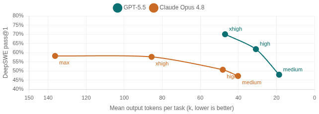
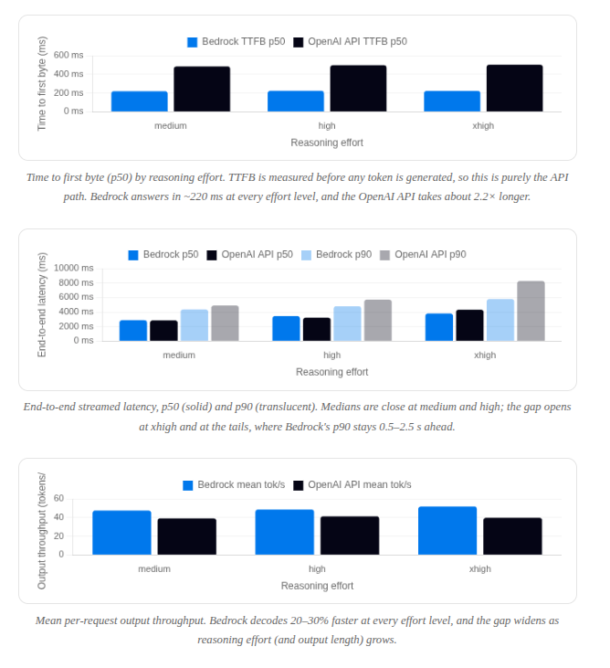
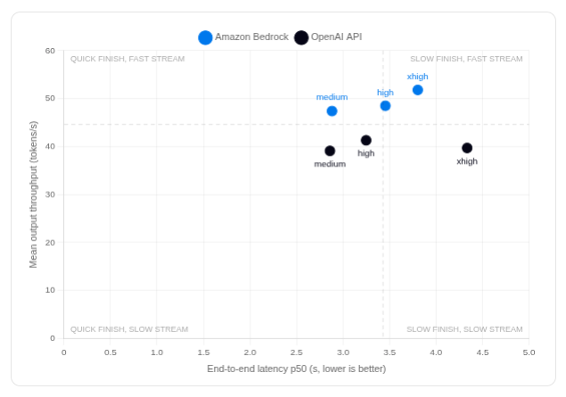
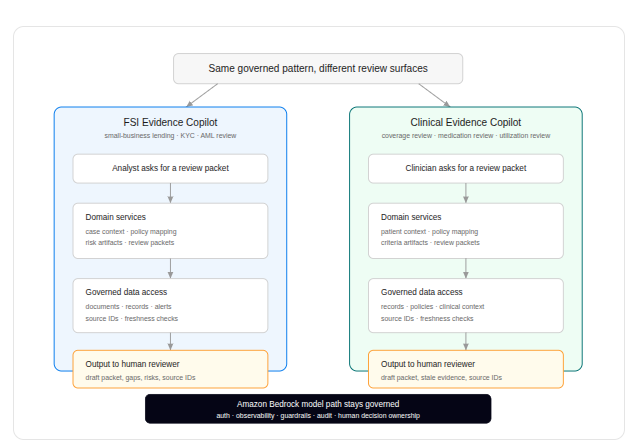
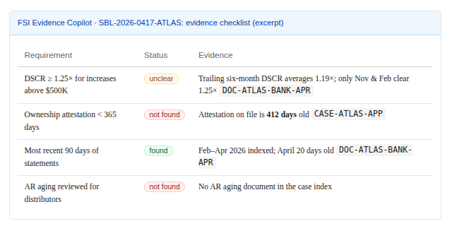
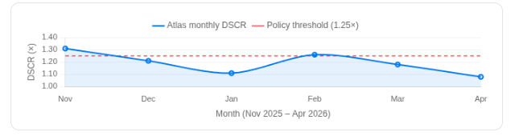
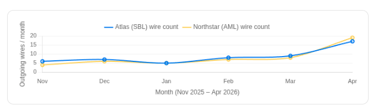
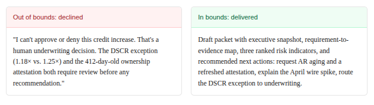
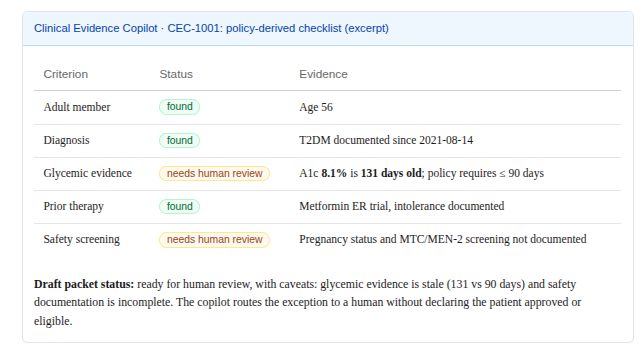
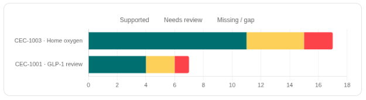

## Introduction

OpenAI **GPT-5.5, GPT-5.4, and Codex** are now generally
available on **Amazon Bedrock**. For enterprises, that is more than
a new catalog entry. It creates a path to use OpenAI capabilities inside the AWS
security, governance, procurement, and operational controls they already run.
Loka is one of only five OpenAI launch partners globally, giving us a front-row
role in helping customers turn this new path into production systems.

That designation is both a milestone and a practical signal. Since 2023, Loka
teams have helped lead more than 500 GenAI and agentic AI launches, with over half
already in production or moving there. OpenAI on Bedrock gives that work a cleaner
route from experimentation to secure, scalable enterprise systems in the AWS
environments customers already trust.

A launch is easy to celebrate and hard to substantiate. So this post covers
two things:

1. **A benchmark: GPT-5.5 on Bedrock vs. the native OpenAI API.**
Before we built anything, we asked the foundational question: does routing
GPT-5.5 through Amazon Bedrock change the model you get? We ran the full
GSM8K test split (1,319 questions) through both provider paths at three
reasoning levels and compared accuracy, latency, throughput, and reliability
head to head. The benchmark confirmed the same answer quality, faster
serving, and zero failures on Bedrock.
2. **Two regulated-industry copilots, built on the path that passed.**
Using Loka's production agent architecture and delivery patterns, we stood up
the **FSI Evidence Copilot** (financial services: evidence
packets for small-business lending, KYC refresh, and AML alert review) and
the **Clinical Evidence Copilot** (healthcare & life
sciences: synthetic-patient evidence packets for coverage and medication
reviews). The point is not to expose implementation mechanics; it is to show
how authentication, scoped data access, observability, guardrails,
deployment, and human review can travel across use cases.

They share production obligations: governed access, traceability, guardrails,
deployment discipline, and, most importantly, a human-review boundary.
**Both prepare evidence for a human; neither makes the decision.**
The domain services and data sources differ by use case, but the validated
model path is the same: OpenAI on Bedrock, benchmarked before it was trusted
with production workloads.

For the engineering walkthrough behind the benchmark harness, commands,
result files, and scoring logic, read our companion Medium post:
[Benchmarking GPT-5.5 on
Amazon Bedrock vs. the OpenAI API](https://medium.com/p/3d57899fc058).

What we want you to take away. The useful unlock is the
combination of a model-agnostic production architecture, Bedrock's governance
surface, and OpenAI-compatible APIs, all verified to be production-grade
before the first line of copilot code was written. Together, they let teams
move regulated workloads from prototype to production while preserving the AWS
controls their security and platform teams already understand.

## Why OpenAI on Bedrock matters for the enterprise

For enterprises already running regulated workloads on AWS, the biggest obstacle
is often the operational change that follows when data, access controls, audit
trails, procurement terms, and procedures move outside the approved cloud
environment. A new model vendor can trigger security review, legal review,
data-processing review, vendor onboarding, logging changes, and new runbooks.
OpenAI models on Bedrock make the shift materially smaller because the model
choice sits inside the AWS control plane teams already trust:

| Concern | What Bedrock gives you |
| --- | --- |
| Data residency & privacy | Inference runs in the selected Bedrock Region; prompts and responses are not used to train models or shared with model providers. |
| Identity & access | Standard AWS controls such as IAM, VPC connectivity, and CloudTrail around the model invocation path. |
| Safety | Amazon Bedrock Guardrails and platform controls can be applied through supported Bedrock APIs and model paths. |
| API fit & portability | Use AWS-native APIs such as `Converse` for supported models, or OpenAI-compatible `Responses` and chat-completions APIs on Bedrock when that is the better fit. |

That last row is the one that compounds. For existing Bedrock-native workloads,
`Converse` keeps a common interface across supported model families.
For GPT-5.5, GPT-5.4, and Codex on Bedrock, AWS points developers to the
OpenAI-compatible `Responses` API on the Bedrock Mantle endpoint. The
exact adapter can change by workload, while the architecture stays steady: model
selection belongs in configuration, while auth, evidence access, auditability,
streaming, and deployment stay stable.

### Capability is part of the enterprise case

The governance story only matters if the models are worth adopting. Today, the
evidence is strongest in agentic software work: on Datacurve's DeepSWE benchmark,
which measures long-horizon repository tasks, GPT-5.5 leads the published sweep
while using fewer output tokens than Opus 4.8 at comparable and higher reasoning
levels. Opus 4.8 improves as reasoning effort rises and has strong results too,
but its max configuration spends far more output tokens and time for a lower
pass@1 than GPT-5.5 xhigh. The enterprise takeaway is that the Bedrock launch
brings one of the current frontier leaders into the AWS operating model teams
already use.

Anthropic has since released Claude Fable 5, the first
of its Claude 5 family and a tier in positions above Opus. It is new enough that
the published sweeps in this post do not yet include it, and nothing in this
post turns on it. Since our comparison is about provider paths for models of comparable weights,
and not whatever lab holds the leaderboard for best model, we decided not to include it here.

DeepSWE snapshot from Datacurve, updated May 30, 2026. X axis is mean output tokens per task; Y axis is pass@1. Each point is labeled by reasoning level. Tooltips include cost and time per task.

Codex adds the adoption signal behind the benchmark story. OpenAI reports that
more than 5 million people use Codex every week, with non-developers now making up
about 20% of users and growing more than three times as fast as developers. That
matters for enterprises because the same agentic pattern is moving from coding into
analysis, reporting, workflow automation, and other knowledge work, exactly the
kind of operational surface where AWS governance and procurement matter.

## Benchmarking GPT-5.5 on Bedrock against the OpenAI API

Capability is only half the enterprise question. The other half is whether the
governed model path costs you anything in accuracy, in the latency users feel,
or in reliability. So we measured it. We ran the full **GSM8K test split
(1,319 questions)** through both provider paths, with
`openai.gpt-5.5` on Amazon Bedrock Mantle in `us-east-2`
and `gpt-5.5` on the OpenAI first-party API, at three reasoning
efforts (*medium*, *high*, *xhigh*). Same prompts, same
OpenAI-compatible `Responses` shape, same output caps, same streaming
metric definitions, and sequential requests so client-side concurrency never
pollutes the numbers. That setup answers two questions at once. Does quality
survive the provider change, and which path is faster in practice?

### Accuracy survives the provider change

| Reasoning effort | Bedrock `openai.gpt-5.5` | OpenAI `gpt-5.5` | Delta |
| --- | --- | --- | --- |
| medium | 97.57% | 97.42% | −0.15 pp |
| high | 97.57% | 97.35% | −0.22 pp |
| xhigh | 97.42% | 97.35% | −0.07 pp |

Bedrock edges ahead in all three runs, but the honest read is parity. The gaps
are one to three questions out of 1,319, well within run-to-run noise for a
sampled model. That is the result an enterprise team wants to see. It says the
weights behind both endpoints behave the same, so moving the workload onto the
governed AWS path costs nothing in answer quality, and everything that
*does* differ between the two paths is serving infrastructure.

### Bedrock is faster where it matters

| Effort | Provider | TTFB p50 | TTFT p50 | Total p50 | Total p90 | Mean tok/s | Failed |
| --- | --- | --- | --- | --- | --- | --- | --- |
| medium | Bedrock | 220 ms | 1,939 ms | 2,881 ms | 4,369 ms | 47.4 | 0 / 1,319 |
| medium | OpenAI | 484 ms | 1,956 ms | 2,859 ms | 4,908 ms | 39.1 | 2 / 1,319 |
| high | Bedrock | 224 ms | 2,662 ms | 3,455 ms | 4,801 ms | 48.5 | 0 / 1,319 |
| high | OpenAI | 497 ms | 2,356 ms | 3,248 ms | 5,712 ms | 41.3 | 1 / 1,319 |
| xhigh | Bedrock | 223 ms | 3,250 ms | 3,803 ms | 5,792 ms | 51.8 | 0 / 1,319 |
| xhigh | OpenAI | 502 ms | 3,280 ms | 4,334 ms | 8,273 ms | 39.7 | retried* |

*The OpenAI xhigh run needed failed requests retried to complete all 1,319
samples; the published numbers come from the merged clean run. Bedrock completed
all 3,957 requests across the three efforts with zero errors.

Time to first byte (p50) by reasoning effort. TTFB is measured before any token
is generated, so this is purely the API path. Bedrock answers in ~220 ms at
every effort level, and the OpenAI API takes about 2.2× longer.

End-to-end streamed latency, p50 (solid) and p90 (translucent). Medians are
close at medium and high; the gap opens at xhigh and at the tails, where
Bedrock's p90 stays 0.5–2.5 s ahead.

Mean per-request output throughput. Bedrock decodes 20–30% faster at every
effort level, and the gap widens as reasoning effort (and output length) grows.

The medians deserve an honest read. At medium and high effort the
*median* end-to-end latencies are effectively tied (the Bedrock high run
actually spent slightly more reasoning tokens, which costs it the p50 comparison
there). But every other dimension leans one way. Time to first byte is ~220 ms
on Bedrock versus ~480–500 ms on the OpenAI API at every effort level. Mean
output throughput is 20–30% higher on Bedrock. The tail percentiles (p90/p95)
favor Bedrock in all three runs and the gap grows with effort. At xhigh, p95 is
9.2 s on Bedrock versus 11.4 s on OpenAI. Reliability went one way only. Bedrock
finished nearly 4,000 calls without a single failure, while every OpenAI run had
errored requests, including stalled outliers that ran past 100 seconds.

### Why is Bedrock faster? Our three cents

The accuracy parity above is what makes the latency question interesting. If the
model is the same, the difference is the serving path. Three observations from
the data, offered as informed interpretation rather than inside knowledge:

- **The TTFB gap is infrastructure, not the model.** Time to first
byte is measured before a single token is generated, so it captures connection
setup, authentication, admission, and routing. Bedrock's regional endpoint held
a flat ~220 ms p50 across all three runs regardless of effort; the OpenAI API hovered
around ~480–500 ms with a much heavier tail (p99 of ~3 s, worst cases over
100 s). That is the difference between a dedicated regional AWS endpoint and a
globally shared API front door absorbing the world's GPT-5.5 traffic.
- **OpenAI's throughput looks paced; Bedrock's looks unconstrained.**
Across ~3,950 OpenAI requests, per-request decode speed clustered tightly
(stddev ~9.5 tok/s) and *never once exceeded ~67 tok/s*. The observed
maximum was 66.2, 66.7, and 66.7 tok/s in the three runs, which looks like a
deliberate per-request ceiling or aggressive batching on a heavily multi-tenant
fleet. Bedrock requests ranged up to ~108 tok/s with means of 47–52. Consistent
with newer, less-contended capacity that is not yet rationing decode speed.
- **Demand asymmetry, for now.** The first-party API serves the
bulk of global GPT-5.5 demand; the Bedrock endpoint launched weeks ago. Lower
utilization means shorter queues, faster admission, and tighter tails, which is
exactly the shape of the data, including Bedrock's zero error rate. The honest
caveat is that this part of the advantage can narrow as Bedrock adoption grows.

There is also a hardware angle. Amazon's
[$50 billion investment in OpenAI](https://www.aboutamazon.com/news/aws/amazon-open-ai-strategic-partnership-investment)
comes with a commitment of
[roughly 2 gigawatts of Trainium capacity](https://www.tomshardware.com/tech-industry/amazon-invests-50-billion-in-openai),
and in March AWS and Cerebras
[announced a serving architecture](https://press.aboutamazon.com/aws/2026/3/aws-and-cerebras-collaboration-aims-to-set-a-new-standard-for-ai-inference-speed-and-performance-in-the-cloud)
that splits inference across purpose-built silicon, with Trainium handling the
parallel prefill phase and Cerebras wafer-scale chips handling the
bandwidth-hungry decode phase. AWS is pitching it as "the fastest AI inference
available through Amazon Bedrock." We don't know what hardware served our
requests, since neither company says. The only public speed figure for OpenAI on
Cerebras, at
[over 1,000 tokens per second](https://openai.com/index/introducing-gpt-5-3-codex-spark/),
comes from a much smaller model built specifically for that hardware, so it
says little about what GPT-5.5 would do there. The more useful signal is AWS's
own framing. The announcement describes the new stack as launching months later
and as "an order of magnitude faster" than what Bedrock serves today. A 20–30%
throughput edge is not an order of magnitude, so whatever served our requests,
the new silicon doesn't explain the gap we measured. What it does tell you is
where this is going. AWS is building Bedrock to be the fastest place to run
these models, and the advantage we measured is probably the early version of it.

Independent corroboration. We are not the only ones measuring
this. Artificial
Analysis's GPT-5.5 provider comparison reaches the same conclusion on a
different workload, measuring Bedrock at 52.3 output tok/s versus OpenAI at
50.5, with materially lower end-to-end latency on their xhigh measurement
(~76 s vs ~100 s to first answer token), summarized on their page as "Amazon
offers the best performance with both the highest speed and lowest latency."
Their
medium-effort page
shows the same shape, 53.8 vs 48.3 tok/s and 7.9 s vs 9.5 s to first answer
token, independently matching the direction of every latency and throughput
number we measured. The flip side is also theirs. OpenAI's list price is
slightly lower ($5.00/$30.00 vs $5.50/$33.00 per 1M input/output tokens), so
the trade is roughly 10% on price for the faster, more reliable path that also
lives inside AWS governance.

Our six GSM8K runs as a quadrant, with median end-to-end latency against mean
output throughput and both axes starting at zero. Points are labeled by
reasoning effort. Up and to the left is the good corner. Bedrock streams
faster at every effort, while the latency medians stay close at medium and
high and separate at xhigh.

Scope of these numbers. One model (GPT-5.5), one Bedrock Region
(us-east-2), one client location, sequential single-stream
requests, short math prompts, measured in June 2026. Latency and error rates are
point-in-time properties of a serving fleet, not constants. Rerun against your
own region, workload shape, and concurrency before committing an SLO to these.

## Production service pattern

That was the measurement half of this post. The benchmark validated the model
path, with the same answer quality, faster serving, and zero failures on
Bedrock, so from here on we switch from measuring to building: everything below
is about the two copilots we shipped on that path.

### What gets easier with OpenAI on Bedrock

In the examples below, the announcement matters because teams can pair OpenAI's
strongest reasoning and agentic models with the AWS controls that already govern
regulated workloads:

| Build pressure | Why OpenAI on Bedrock helps |
| --- | --- |
| Hard reasoning over messy evidence | GPT-5.5 and GPT-5.4 are available for complex professional and agentic work, so the same review workflow can use stronger models without leaving AWS. |
| Security and platform review | Inference stays in the selected Bedrock Region and runs under AWS controls like IAM, PrivateLink/VPC isolation, KMS encryption, and CloudTrail logging. |
| Procurement and scale-up | Usage can count through existing AWS commitments, which removes a common blocker between prototype approval and production rollout. |
| Engineering velocity | The OpenAI-compatible `Responses` API lets teams adapt existing OpenAI patterns while keeping deployment, auth, observability, and data access on AWS. |

### One governed pattern, two copilots

The healthcare and financial-services demos share something more useful than a
shared implementation: a governed service pattern. Each one starts with
authenticated access, retrieves only scoped evidence, maps that evidence to policy,
labels gaps and stale records, emits observable traces and artifacts, applies
guardrails around scope, and leaves the final decision with a qualified human.

The two copilots use the same production service pattern across different
domains. Each retrieves scoped evidence, turns it into a cited draft packet, and
hands the decision back to a human reviewer.

This is the useful kind of reuse. The healthcare and financial-services examples
read different sources and produce different review artifacts because the work is
different. What stays the same is the operating contract: cite the evidence, expose
gaps, preserve auditability, keep the run observable, and refuse the final call.

OpenAI on Bedrock matters here because the model can change without moving the
workflow out of the governed AWS environment. For GPT-5.5, GPT-5.4, and Codex,
AWS points developers to the OpenAI-compatible `Responses` API on
Bedrock Mantle. The adapter changes; the domain services, source IDs, auth boundary,
audit trail, and human-review output contract should stay intact.

That also makes model migration more practical. Teams already running Bedrock
workloads on Anthropic, Amazon Nova, or other supported model families can add
OpenAI where it fits without rebuilding the surrounding product. The work is still
an engineering migration, not a string replacement: model IDs, invocation adapters,
streaming behavior, tool contracts, observability hooks, and regression checks all
need attention. But the business workflow, AWS security posture, and production
service boundary can remain recognizable.

## Financial services: the FSI Evidence Copilot

We lead with financial services because the cost of a wrong call is unambiguous.
Lending, KYC, and AML review are evidence-assembly problems wearing a decision's
clothing: an analyst has to find the policy, locate every qualifying fact across
statements and alerts, decide what is missing, and document the chain before any
human judgment is even possible. The FSI Evidence Copilot does the assembly and,
critically, never approves credit, files a SAR, closes an alert, or freezes funds.

| Question | Answer |
| --- | --- |
| What is manual today? | An analyst hunts across bank statements, case notes, policies, and alerts before the real review can begin. |
| What does the copilot do? | It assembles a requirement-by-requirement evidence packet with source IDs, missing items, and stale documents called out. |
| Where does the human stay in control? | The analyst still approves, denies, escalates, files, or closes. The agent only prepares the packet. |
| What changes operationally? | Less prep time, fewer uncited claims, and a clearer audit trail for every exception. |

 

| Tool | What it does |
| --- | --- |
| `fsi_list_cases` / `fsi_get_case_brief` | Enumerate synthetic cases and pull case facts with source IDs. |
| `fsi_map_policy_evidence` | Map each policy requirement to evidence, with explicit gap and staleness flags. |
| `fsi_create_chart_artifact` | Generate cash-flow / risk chart artifacts for the packet. |
| `fsi_draft_review_packet` | Assemble the draft, human-review-only packet. |

### Walkthrough: small-business credit renewal (Atlas Industrial Supplies)

Atlas, a regional industrial-parts distributor, asks to raise its credit line from
$450K to $700K. The copilot opens the case, maps the *Small Business Credit
Policy 2026*, and immediately sorts the file into supported evidence and open
gaps:

FSI Evidence Copilot · SBL-2026-0417-ATLAS: evidence checklist (excerpt)

RequirementStatusEvidence

The first graph earns its keep by putting the underwriting exception in one
glance. The policy says credit increases above
$500K need DSCR at or above 1.25×. Atlas is below that floor in four of the last
six months, with a January trough at 1.11× and an April reading of 1.08×. Instead
of producing an automated denial, the copilot gives the analyst the evidence
behind a request that cannot be rubber-stamped.

Atlas monthly DSCR vs. the 1.25× policy threshold (dashed). Source: DOC-ATLAS-BANK-APR.

The second graph needs more context, because wire counts alone cannot prove
suspicious activity. We include it because it shows the same review pattern in a
different financial-services workflow: the agent spots a jump, attaches it to the
source alert, and explains why a human should look. Atlas jumps to 17 outgoing
wires in April against a five-month average of seven. Northstar, an AML case,
spikes to 19 against an expected five. The copilot routes the anomaly into the
review packet for a human to evaluate.

Monthly outgoing wire count. The chart gives reviewers a triage cue: the copilot surfaces the spike, cites the source alert, and routes the anomaly to a human reviewer.

When asked to just approve the increase, the copilot refuses the decision and offers the next analyst action instead:

Out of bounds: declined

"I can't approve or deny this credit increase. That's a human underwriting
decision. The DSCR exception (1.18× vs. 1.25×) and the 412-day-old ownership
attestation both require review before any recommendation."

In bounds: delivered

Draft packet with executive snapshot, requirement-to-evidence map, three
ranked risk indicators, and recommended next actions: request AR aging and a
refreshed attestation, explain the April wire spike, route the DSCR exception
to underwriting.

<figure class="post-video">
<video controls preload="metadata" poster="https://lokahq.github.io/gpt-bedrock-openai-benchmark/blog/assets/fsi-copilot-thumb.png">
<source src="https://lokahq.github.io/gpt-bedrock-openai-benchmark/blog/assets/fsi-copilot-demo.mp4" type="video/mp4">
</video>
<figcaption>The FSI Evidence Copilot launch walkthrough: case brief → checklist → cash-flow chart → draft packet, with the decision boundary held throughout.</figcaption>
</figure>

## Healthcare: the Clinical Evidence Copilot

Swap the industry, keep the pattern. Utilization review and prior authorization are
the same evidence-assembly problem with different policies: find the relevant
policy, locate every qualifying fact in a messy chart, and decide what is missing,
all while keeping the same hard boundary around the judgment. The Clinical Evidence
Copilot does the assembly; a clinician makes the call.

| Question | Answer |
| --- | --- |
| What is manual today? | A reviewer reads chart notes, labs, medication history, and coverage policy to determine whether the file is ready for review. |
| What does the copilot do? | It maps each policy criterion to chart evidence, labels stale or missing documentation, and exports a draft packet. |
| Where does the human stay in control? | A clinician still decides coverage, medical necessity, or next clinical action. The agent never declares eligibility. |
| What changes operationally? | Faster chart prep, clearer missing-document requests, and a review record that can be defended. |

It works one synthetic patient at a time, and for every claim it cites a source ID returned by its tools:

| Tool | What it does |
| --- | --- |
| `clinical_evidence_workspace` | Patient brief, timeline, criteria mapping, and missing-documentation review. |
| `list/read/save_clinical_policy` | Inspect Markdown coverage policies, or draft one (flagged for human review). |
| `save_clinical_evidence_packet` | Export a draft evidence packet as a downloadable artifact. |

### Demo 1: Home oxygen therapy (CEC-1003)

A 71-year-old synthetic patient requests a home oxygen concentrator. There is no
policy on file, so the copilot drafts one (marked `DRAFT, REQUIRES HUMAN
REVIEW`), then maps 17 criteria to the chart: 11 supported, 4 needing review,
2 missing. It surfaces the clinically decisive fact: a six-minute walk test where
SpO₂ fell to 86% on room air and recovered to 93% on 2 L/min. It also clearly
flags the gaps a reviewer must close, like the absent ICD-10 code.

### Demo 2: GLP-1 diabetes medication review (CEC-1001)

A 56-year-old synthetic patient is up for a GLP-1 (semaglutide) review. The copilot
pulls the chart timeline, maps the policy checklist, and lands on the kind of
subtle, easy-to-miss finding that makes or breaks a review:

<figure class="post-video">
<video controls preload="metadata" poster="https://lokahq.github.io/gpt-bedrock-openai-benchmark/blog/assets/clinical-glp1-poster.png">
<source src="https://lokahq.github.io/gpt-bedrock-openai-benchmark/blog/assets/clinical-glp1-demo.mp4" type="video/mp4">
</video>
<figcaption>The Clinical Evidence Copilot preparing the GLP-1 review (CEC-1001) end to end.</figcaption>
</figure>

The final chart gives reviewers a readiness view. Green means the file has
evidence for that criterion. Amber means the criterion may be supportable but needs
human review, for example, stale A1c or
incomplete safety screening. Red means the record is missing something the reviewer
should request before spending time on a final determination.

Criteria status by review. The useful signal includes what is supported, stale, ambiguous, or missing before the clinician opens the chart.

## The shared pattern: evidence over decisions

These two copilots feel like the same product because of the operating contract
baked into the product behavior and enforced by guardrails. In regulated work, this
contract is the difference between a tool people are allowed to use and a demo that
never ships:

- **Cite everything.** Every material claim references a source ID (a chart note, a bank statement, an alert) or a policy section. No uncited assertions.
- **Name the gaps as loudly as the matches.** Each criterion gets exactly one status: *found*, *not found*, *unclear*, or *needs human review*. Stale and missing evidence are first-class outputs.
- **Refuse the final call.** No "approved," "denied," "eligible," or "file the SAR." The copilot drafts; a licensed human decides.
- **Stay in scope.** One patient or one case at a time, synthetic data only, no invented facts.

Why the boundary helps. The temptation with a capable model is
to let it decide. In healthcare and financial services, that judgment belongs
with a qualified human. By designing the agent to be
excellent at assembly and deliberately incapable of determination,
the human reviewer gets leverage without inheriting a black-box decision they
can't defend.

## From migration to production

The reason we can present two copilots instead of one is that the architecture is
service-oriented and repeatable without exposing business logic as product glue. A
production agent service needs clear separation between the model path, domain
services, policy assets, authentication, session controls, observability, guardrails,
evaluation, and deployment.

In practical terms, that means teams can migrate or extend OpenAI workloads by
changing the model adapter and deployment posture while preserving the surrounding
service: identity, audit trails, scoped retrieval, token streaming, artifact
generation, monitoring, and human-review controls. Bedrock becomes the governed
model path, while the product experience and domain services remain stable.

Because the model path lives behind Bedrock, choosing OpenAI for the next
engagement becomes a platform decision the team can make per workload:
`openai.gpt-5.5` for the hardest reasoning, `openai.gpt-5.4`
for price-performance-sensitive professional work, or an open-weight
`openai.gpt-oss-120b` / `openai.gpt-oss-20b` model when
throughput and cost dominate. The product architecture isolates the adapter from
the review workflow, so adapters can change without disturbing the operating model.

This is the same muscle behind 500+ GenAI and agentic launches since 2023, more
than half of which are moving to or already running in production. The launch of
OpenAI on Bedrock keeps that playbook intact and adds a powerful new option to
the one slot in it that was always meant to be swappable.

## Conclusion

OpenAI models on Amazon Bedrock give enterprises a path to build secure, scalable
GenAI inside the AWS ecosystem they already trust. The two copilots here make the
case in practical terms: one architecture pattern, one human-in-the-loop discipline, two
regulated industries, and a model/provider boundary narrow enough to change without
rebuilding the product.

If you're trying to move from AI experimentation to production at scale, this is the
conversation we want to have. Let's talk about what an evidence-first copilot looks
like for your team, built with OpenAI on Amazon Bedrock by a launch partner who
has taken hundreds of GenAI and agentic systems from idea to launch.

Catch the announcement →
OpenAI models and Codex on Amazon Bedrock are now generally available.
Want to build with OpenAI on Amazon Bedrock? Let's connect.

## Further reading

1. AWS (2026). *OpenAI models and Codex on Amazon Bedrock are now generally available.*
AWS Machine Learning Blog.
[aws.amazon.com](https://aws.amazon.com/blogs/machine-learning/openai-models-and-codex-on-amazon-bedrock-are-now-generally-available/)
2. AWS (2026). *APIs supported by Amazon Bedrock.*
API support, endpoints, and model invocation reference.
[docs.aws.amazon.com](https://docs.aws.amazon.com/bedrock/latest/userguide/apis.html)
3. AWS (2026). *Get started with OpenAI GPT-5.5, GPT-5.4 models, and Codex on Amazon Bedrock.*
AWS News Blog.
[aws.amazon.com](https://aws.amazon.com/blogs/aws/get-started-with-openai-gpt-5-5-gpt-5-4-models-and-codex-on-amazon-bedrock/)
4. AWS (2026). *Inference using Responses API.*
Amazon Bedrock User Guide.
[docs.aws.amazon.com](https://docs.aws.amazon.com/bedrock/latest/userguide/bedrock-mantle.html)
5. AWS (2026). *GPT-5.5 model card.*
Programmatic access details for the GPT-5.5 Bedrock Mantle endpoint.
[docs.aws.amazon.com](https://docs.aws.amazon.com/bedrock/latest/userguide/model-card-openai-gpt-55.html)
6. OpenAI (2026). *OpenAI frontier models and Codex are now available on AWS.*
[openai.com](https://openai.com/index/openai-frontier-models-and-codex-are-now-available-on-aws/)
7. OpenAI (2026). *API pricing.*
Model token pricing, Batch pricing, and reasoning-token billing notes.
[platform.openai.com](https://platform.openai.com/docs/pricing/)
8. Datacurve (2026). *DeepSWE.*
Long-horizon software engineering benchmark and leaderboard.
[deepswe.datacurve.ai](https://deepswe.datacurve.ai/)
9. Artificial Analysis (2026). *GPT-5.5: API provider comparison.*
Independent cross-provider measurements of output speed, latency, and price,
at [xhigh](https://artificialanalysis.ai/models/gpt-5-5/providers)
and [medium](https://artificialanalysis.ai/models/gpt-5-5-medium/providers)
reasoning effort.
10. Amazon (2026). *OpenAI and Amazon announce strategic partnership.*
The $50B investment and the ~2 GW Trainium capacity commitment.
[aboutamazon.com](https://www.aboutamazon.com/news/aws/amazon-open-ai-strategic-partnership-investment)
11. Amazon (2026). *AWS and Cerebras collaboration aims to set a new standard
for AI inference speed and performance in the cloud.*
Disaggregated inference: Trainium prefill, Cerebras wafer-scale decode.
[press.aboutamazon.com](https://press.aboutamazon.com/aws/2026/3/aws-and-cerebras-collaboration-aims-to-set-a-new-standard-for-ai-inference-speed-and-performance-in-the-cloud)
12. The New Stack (2026). *AWS lands OpenAI on Bedrock, but Trainium is the
real story.* Analysis of the silicon strategy behind the Bedrock launch.
[thenewstack.io](https://thenewstack.io/openai-bedrock-trainium-silicon/)
13. OpenAI (2026). *Codex for every role, tool, and workflow.*
Codex usage and adoption update.
[openai.com](https://openai.com/index/codex-for-every-role-tool-workflow/)
